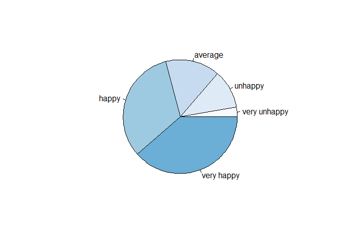
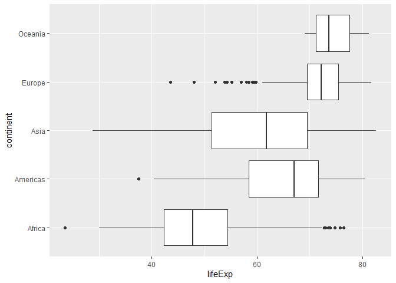

<style type="text/css"> 
body{
  font-size: 12pt;
}
code.r{
  font-size: 12pt;
}
</style>


# Data Frames

A data frame is similar to a rectangular spreadsheet where rows represent observations and columns represents variables (or features). In some ways, it is also similar to a matrix, but a data frame can contain different types of variables in the columns (string, numeric, etc.) whereas a matrix can contain only one type. As an example, suppose we have the following sales records on three different product: 


```r
year <- c(2008:2013)
product1 <- c(0,3,6,9,7,8)
product2 <- c(1,2,3,5,9,6)
product3 <- c(2,4,4,2,3,2)
```

Now, let's create a data frame using `data.frame()`

```r
sales <- data.frame(year, product1, product2, product3)
sales
```

```
##   year product1 product2 product3
## 1 2008        0        1        2
## 2 2009        3        2        4
## 3 2010        6        3        4
## 4 2011        9        5        2
## 5 2012        7        9        3
## 6 2013        8        6        2
```

```r
str(sales)
```

```
## 'data.frame':	6 obs. of  4 variables:
##  $ year    : int  2008 2009 2010 2011 2012 2013
##  $ product1: num  0 3 6 9 7 8
##  $ product2: num  1 2 3 5 9 6
##  $ product3: num  2 4 4 2 3 2
```

The data frame `sales` has 6 observations on 4 variables. Note that variable types (int, num) are also shown in the `str()` output above. You can also use `View(sales)` command to see the contents of the data set. 

Suppose that we want to export our data frame and save it as  a `csv` file (comma separated value). We can use `write.csv()` function for that as follows 

```r
write.csv(sales, file = "mydata.csv", row.names = FALSE)
```

Note that the file will be saved in the current directory. To see your current directory use `getwd()` and change it using `setwd("put your address here")`. 

Alternatively, we can use `write.table()` function to export it into `txt` or `csv` formats: 

```r
# text 
write.table(sales, file = "mydatatxt.txt", sep = " ", row.names = FALSE)
# csv without row or col names: 
write.table(sales, file = "mydatacsv.csv", sep = ",", row.names = FALSE, col.names = FALSE)
```

How about Excel format? For this we can install the package `writexl`:

```r
library(writexl)
write_xlsx(sales, path = "mydataxlsx.xlsx", col_names = FALSE)
```

Note that the column names can be preserved by changing the `col_names` option to `TRUE`.  

# Importing Data from Text, csv, and Excel files 

`read.table()` command enables `R` to read text files and then to store them as data frames. The option `header = TRUE` imports the first line as the variable names. The `sep=" "` option specifies the arguments like spaces, tabs and comma that separate the columns.

In the previous section, we saved a few data files in various formats. Now suppose that we want to import them into our `R` environment.  
Let's start with the file `mydatatxt.txt` which includes a header (variable names). We can use `read.table()` to read the data: 

```r
sales2 <- read.table("mydatatxt.txt", header = TRUE)
sales2
```

```
##   year product1 product2 product3
## 1 2008        0        1        2
## 2 2009        3        2        4
## 3 2010        6        3        4
## 4 2011        9        5        2
## 5 2012        7        9        3
## 6 2013        8        6        2
```

The same data are contained in `mydatacsv.csv` file separated by a comma and without header: 

```r
sales3 <- read.table("mydatacsv.csv", sep = ",")
sales3
```

```
##     V1 V2 V3 V4
## 1 2008  0  1  2
## 2 2009  3  2  4
## 3 2010  6  3  4
## 4 2011  9  5  2
## 5 2012  7  9  3
## 6 2013  8  6  2
```

Note that column names in the `sales3` data frame are automatically generated as `V1, V2, V3, V4`. We can change the column names as follows: 

```r
colnames(sales3) <- c("year", "prod1", "prod2", "prod3")
sales3
```

```
##   year prod1 prod2 prod3
## 1 2008     0     1     2
## 2 2009     3     2     4
## 3 2010     6     3     4
## 4 2011     9     5     2
## 5 2012     7     9     3
## 6 2013     8     6     2
```

 
To import excel files following command may be helpful.


```r
library(readxl)
sales4 <- read_xlsx("mydataxlsx.xlsx", col_names = FALSE) 
```

```
## New names:
## * `` -> ...1
## * `` -> ...2
## * `` -> ...3
## * `` -> ...4
```

```r
sales4
```

```
## # A tibble: 6 x 4
##    ...1  ...2  ...3  ...4
##   <dbl> <dbl> <dbl> <dbl>
## 1  2008     0     1     2
## 2  2009     3     2     4
## 3  2010     6     3     4
## 4  2011     9     5     2
## 5  2012     7     9     3
## 6  2013     8     6     2
```
We note that the `read_xlsx()` command produces a `tibble` instead of a data frame. A `tibble` is the same as a data frame but it may be more flexible (more on this later). 

# Creating a new variable

Once we have our data frame or tibble, we can easily create new variables using the 
assignment operator `<-` is used to create new variables. We note that the equality sign also works but we prefer using `<-`. For instance, we can create a new varible containing total sales in the  `sales` data frame which we created above.


```r
sales$total <- sales$product1 + sales$product2 + sales$product3 
sales
```

```
##   year product1 product2 product3 total
## 1 2008        0        1        2     3
## 2 2009        3        2        4     9
## 3 2010        6        3        4    13
## 4 2011        9        5        2    16
## 5 2012        7        9        3    19
## 6 2013        8        6        2    16
```

If there are missing observations in the data frame, then the resulting new variables will also be missing (`NA`). 

We can add a new variable `cat` to categorize total sales value as `high` or `low.`

```r
sales$cat[sales$total>15] <- "high"
sales$cat[sales$total<15] <- "low"
sales
```

```
##   year product1 product2 product3 total  cat
## 1 2008        0        1        2     3  low
## 2 2009        3        2        4     9  low
## 3 2010        6        3        4    13  low
## 4 2011        9        5        2    16 high
## 5 2012        7        9        3    19 high
## 6 2013        8        6        2    16 high
```

# Missing values and dropping observations

Sometimes data sets may not be complete and include missing values. Missing values are displayed as `NA` (not available) in `R`. Consider the following data frame:


```r
name <- c("firm1", "firm2", "firm3")
prod1 <- c(100, 150, NA)
prod2 <- c(90, 75, 100)
prod3 <- c(110, NA, 150)
prod_data<-data.frame(name, prod1, prod2, prod3)
prod_data
```

```
##    name prod1 prod2 prod3
## 1 firm1   100    90   110
## 2 firm2   150    75    NA
## 3 firm3    NA   100   150
```

We can identify missing values in the data set with the help of `is.na()` function.

```r
is.na(prod_data)
```

```
##       name prod1 prod2 prod3
## [1,] FALSE FALSE FALSE FALSE
## [2,] FALSE FALSE FALSE  TRUE
## [3,] FALSE  TRUE FALSE FALSE
```

If we want to drop the variables having missing values `na.omit()` can be used.

```r
na.omit(prod_data)
```

```
##    name prod1 prod2 prod3
## 1 firm1   100    90   110
```
 
In order to drop a variable, we can use logical subscripting and declare the column numbers with a `-` sign in front of them. For example, suppose we want to drop prod1 (second column) and prod3 (fourth column), we can use 

```r
newpd<- prod_data[c(-2, -4)]
newpd
```

```
##    name prod2
## 1 firm1    90
## 2 firm2    75
## 3 firm3   100
```


To remove a row following command may be used.


```r
newpd2<- prod_data[c(-2), ]
newpd2
```

```
##    name prod1 prod2 prod3
## 1 firm1   100    90   110
## 3 firm3    NA   100   150
```

If we want to create a subset of the sample `subset()` command may be useful.


```r
## A subset including prod1 and prod3 variables under the prod2<100 constraint.
subdata <- subset(prod_data, prod2<100, select=c(name, prod1, prod3))
subdata
```

```
##    name prod1 prod3
## 1 firm1   100   110
## 2 firm2   150    NA
```

If we want to change the value of the observations, we may use

```r
## Changing the value equaling to 100 in the variable prod1 in prod_data.
prod_data$prod1[prod_data$prod1==100] <- 999
prod_data
```

```
##    name prod1 prod2 prod3
## 1 firm1   999    90   110
## 2 firm2   150    75    NA
## 3 firm3    NA   100   150
```


We sometimes need to handle missing values. In this case `==` does not work.

```r
## Changing NAs in prod1 by 100.
prod_data$prod1[is.na(prod_data$prod1)] <- 100
prod_data
```

```
##    name prod1 prod2 prod3
## 1 firm1   999    90   110
## 2 firm2   150    75    NA
## 3 firm3   100   100   150
```

In some data sets, missing values may be given by numerical values like '999'. In such cases, we can assign `NA` to these observations.

```r
prod_data$prod1[prod_data$prod1==999] <- NA
prod_data
```

```
##    name prod1 prod2 prod3
## 1 firm1    NA    90   110
## 2 firm2   150    75    NA
## 3 firm3   100   100   150
```

# Descriptive statistics

Let us use `wage1` data set from the `wooldridge` package. If you have not done so, you should first install the package and then type

```r
library(wooldridge)
data(wage1)
head(wage1)
```

```
##   wage educ exper tenure nonwhite female married numdep smsa northcen south
## 1 3.10   11     2      0        0      1       0      2    1        0     0
## 2 3.24   12    22      2        0      1       1      3    1        0     0
## 3 3.00   11     2      0        0      0       0      2    0        0     0
## 4 6.00    8    44     28        0      0       1      0    1        0     0
## 5 5.30   12     7      2        0      0       1      1    0        0     0
## 6 8.75   16     9      8        0      0       1      0    1        0     0
##   west construc ndurman trcommpu trade services profserv profocc clerocc
## 1    1        0       0        0     0        0        0       0       0
## 2    1        0       0        0     0        1        0       0       0
## 3    1        0       0        0     1        0        0       0       0
## 4    1        0       0        0     0        0        0       0       1
## 5    1        0       0        0     0        0        0       0       0
## 6    1        0       0        0     0        0        1       1       0
##   servocc    lwage expersq tenursq
## 1       0 1.131402       4       0
## 2       1 1.175573     484       4
## 3       0 1.098612       4       0
## 4       0 1.791759    1936     784
## 5       0 1.667707      49       4
## 6       0 2.169054      81      64
```

You can access individual variables using `dataframe$variablename` syntax. For example, to compute the sample average of wage in the sample we can use 

```r
mean(wage1$wage)
```

```
## [1] 5.896103
```

The average hourly wage in the sample is about USD5.90. To compute the 5-number summary
statistics:  

```r
summary(wage1$wage)
```

```
##    Min. 1st Qu.  Median    Mean 3rd Qu.    Max. 
##   0.530   3.330   4.650   5.896   6.880  24.980
```

The median average wage is USD 4.65, less than the sample mean. This implies that the wage distribution is skewed to right (see the graphs below). 

We can access columns of the data frame using the `attach` command: 

```r
attach(wage1)
summary(educ)
```

```
##    Min. 1st Qu.  Median    Mean 3rd Qu.    Max. 
##    0.00   12.00   12.00   12.56   14.00   18.00
```

List of commands for sample statistics: 

Mean:	`mean()`

Standard deviation:	`sd()`

Variance:	`var()`

Minimum:	`min()`

Maximum:	`max()`

Median:	`median()`

Range of values (minimum and maximum):	`range()`

Sample quantiles:	`quantile()`
 
Interquartile range: 	`IQR()`

We can use `sapply()` function to compute a statistic for each column in a data frame. 
For example, 

```r
sapply(wage1[, 1:6], mean)
```

```
##       wage       educ      exper     tenure   nonwhite     female 
##  5.8961027 12.5627376 17.0171103  5.1045627  0.1026616  0.4790875
```

Note that we computed sample average for the first six columns of `wage1` data set. 
As another example, suppose that we want to compute the quantiles for wage, educ, and exper: 

```r
sapply(wage1[, 1:3], quantile)
```

```
##       wage educ exper
## 0%    0.53    0   1.0
## 25%   3.33   12   5.0
## 50%   4.65   12  13.5
## 75%   6.88   14  26.0
## 100% 24.98   18  51.0
```

**Exercises:** What is the proportion of male workers in the sample? 
Prepare a table of summary statistics for education. 
Prepare a Cross-table of mean wages across gender. Do the same for education. 

# Visualization

## Histogram  


```r
hist(wage) 
```

<!-- -->

Wage distribution is skewed to right (in other words, right tail is longer than left tail).

Here is the histogram of logarithmic wages: 

```r
hist(log(wage))
```

<!-- -->

Histogram of `log(wage)` is more symmetric. 

Histogram of educ: 

```r
hist(educ) 
```

<!-- -->


Smoothed histogram 

```r
hist(wage, freq = FALSE, ylim = c(0, 0.25), xlim = c(0,20))
lines(density(wage))
```

<!-- -->

There are several alternatives to base R graphs. For example, you can use `ggpubr` package which is based on `ggplot2`. 


```r
library(ggpubr)
```

```
## Warning: package 'ggpubr' was built under R version 3.6.3
```

```
## Loading required package: ggplot2
```

```
## Warning: package 'ggplot2' was built under R version 3.6.3
```

```r
gghistogram(log(wage), add = "mean")
```

```
## Warning: Using `bins = 30` by default. Pick better value with the argument
## `bins`.
```

```
## Warning: geom_vline(): Ignoring `mapping` because `xintercept` was provided.
```

```
## Warning: geom_vline(): Ignoring `data` because `xintercept` was provided.
```

<!-- -->


## Box plot


```r
boxplot(wage, horizontal=TRUE)
```

<!-- -->


Box plot should be interpreted with Tukey's 5-number summary, i.e., 

```r
# min Q1 median Q3 max
fivenum(wage)
```

```
## [1]  0.53  3.33  4.65  6.88 24.98
```

```r
summary(wage)
```

```
##    Min. 1st Qu.  Median    Mean 3rd Qu.    Max. 
##   0.530   3.330   4.650   5.896   6.880  24.980
```

We can draw box plot of wage across gender (1=female, 0=male)

```r
boxplot(wage ~ female, horizontal=TRUE)
```

<!-- -->

Here is the logarithmic version: 

```r
boxplot(log(wage) ~ female, horizontal=TRUE)
```

<!-- -->

**Exercise**. What is the percentage difference in average wages between men and women? 

## Categorical Variables

We can prepare a frequency distribution or for categorical variables using `table()`  command. In order to get _shares_ instead of _counts_ we may use `prop.table(table())` command.

```r
## Load affairs data from Wooldridge package.
data(affairs)
head(affairs)
```

```
##   id male age yrsmarr kids relig educ occup ratemarr naffairs affair vryhap
## 1  4    1  37    10.0    0     3   18     7        4        0      0      0
## 2  5    0  27     4.0    0     4   14     6        4        0      0      0
## 3  6    1  27     1.5    0     3   18     4        4        3      1      0
## 4 11    0  32    15.0    1     1   12     1        4        0      0      0
## 5 12    0  27     4.0    1     3   17     1        5        3      1      1
## 6 16    1  57    15.0    1     5   18     6        5        0      0      1
##   hapavg avgmarr unhap vryrel smerel slghtrel notrel
## 1      1       0     0      0      0        1      0
## 2      1       0     0      0      1        0      0
## 3      1       0     0      0      0        1      0
## 4      1       0     0      0      0        0      0
## 5      0       0     0      0      0        1      0
## 6      0       0     0      1      0        0      0
```

There are several categorical variables in the data set. In `R` we can define these as factor variables as follows: 

```r
## Label factor variables "kids" and "ratemarr".
kidslab <- c("no", "yes")
marrlab <- c("very unhappy", "unhappy", "average", "happy", "very happy")

haskid <- factor(affairs$kids, labels = kidslab)
marriage <- factor(affairs$ratemarr, labels = marrlab)
```


```r
## Frequencies for having kids.
table(haskid)
```

```
## haskid
##  no yes 
## 171 430
```


```r
## Share of marriage ratings.
prop.table(table(marriage))
```

```
## marriage
## very unhappy      unhappy      average        happy   very happy 
##    0.0266223    0.1098170    0.1547421    0.3227953    0.3860233
```


### Pie chart


```r
## Pie chart of marriage rating.
pie(table(marriage), col = blues9)
```

<!-- -->

### Bar plot


```r
## Bar plot of marriage rating 
barplot(table(marriage))
```

<!-- -->


```r
## Bar plot of marriage rating by kids
barplot(table(haskid, marriage))
```

<!-- -->


```r
## Bar plot of marriage rating by kids.
barplot(table(haskid, marriage), horiz = TRUE, las=1, legend=TRUE, cex.names=0.55,
        cex.axis = 0.55, args.legend =list(x="right", cex=0.5), col = blues9,
        main = "Happiness by kids")
```

<!-- -->

## Empirical CDF (cumulative density function)
ECDF is the fraction of observations which are less than or equal to some predetermined values within a variable. To plot ECDF __plot(ecdf())__ is used.
For instance, the graph of the ECDF of _wage_ variable may be drawn as follow.


<!-- -->
 
## Scatter Plot

Scatter plot of wage and educ: 

```r
plot(educ, wage) 
```

<!-- -->


Another scatter plot with transparency and high density: 

```r
plot(educ,wage, main="A Scatterplot", col=rgb(0,100,0,50,maxColorValue=255), pch=16)
```

<!-- -->


What is the sample correlation between wage and years of education: 

```r
cor(wage,educ)
```

```
## [1] 0.4059033
```

# Tidy Data 

A **tidy** data set has a consistent (rectangular) structure in which each variable is a column and each row is an observation. After importing the data into R, we can transform it so that it has a tidy structure. Then, we can focus on the analysis.

For more information read Hadley Wickham's paper (Journal of Statistical Software, 2014) [*Tidy Data*](https://vita.had.co.nz/papers/tidy-data.pdf). Also, read the vignette from `tidyr` package  [tidyr](https://cran.r-project.org/web/packages/tidyr/vignettes/tidy-data.html) 


```r
library(tidyverse)
```

```
## -- Attaching packages ----------------------------------------------- tidyverse 1.3.0 --
```

```
## <U+221A> tibble  3.0.1     <U+221A> dplyr   0.8.5
## <U+221A> tidyr   1.0.0     <U+221A> stringr 1.4.0
## <U+221A> readr   1.3.1     <U+221A> forcats 0.4.0
## <U+221A> purrr   0.3.3
```

```
## -- Conflicts -------------------------------------------------- tidyverse_conflicts() --
## x dplyr::filter() masks stats::filter()
## x dplyr::lag()    masks stats::lag()
```


`library(tidyverse)` will load the core tidyverse packages:

`ggplot2`, for data visualisation.
`dplyr`, for data manipulation.
`tidyr`, for data tidying.
`readr`, for data import.
`purrr`, for functional programming.
`tibble`, for tibbles, a modern re-imagining of data frames.
`stringr`, for strings.
`forcats`, for factors.


## Modern version of data frame: Tibble 

Creating a tibble is very easy: 

```r
df <- tibble(
  x  = runif(10),
  y = 1 + 2*x + rnorm(5)
)
df
```

```
## # A tibble: 10 x 2
##         x       y
##     <dbl>   <dbl>
##  1 0.280  -1.04  
##  2 0.193   0.755 
##  3 0.204   0.677 
##  4 0.179  -0.0825
##  5 0.395   3.82  
##  6 0.532  -0.533 
##  7 0.212   0.792 
##  8 0.0414  0.351 
##  9 0.171  -0.0977
## 10 0.593   4.22
```


```r
library(gapminder)
head(gapminder)
```

```
## # A tibble: 6 x 6
##   country     continent  year lifeExp      pop gdpPercap
##   <fct>       <fct>     <int>   <dbl>    <int>     <dbl>
## 1 Afghanistan Asia       1952    28.8  8425333      779.
## 2 Afghanistan Asia       1957    30.3  9240934      821.
## 3 Afghanistan Asia       1962    32.0 10267083      853.
## 4 Afghanistan Asia       1967    34.0 11537966      836.
## 5 Afghanistan Asia       1972    36.1 13079460      740.
## 6 Afghanistan Asia       1977    38.4 14880372      786.
```
`gapminder` is a **tibble**, a special type of data frame. It is different from the traditional `data.frame` in some aspects that make handling data a little easier.


## Manipulating and cleaning data: dplyr and tidyr packages

`dplyr::filter()` function takes logical expressions that can be applied to the rows of the data. It is useful to subset the data based on the rows. For example, create a new tibble, called `trdata`, for the `gapminder` data set: 

```r
trdata <- filter(gapminder, country == "Turkey")
head(trdata)
glimpse(trdata)
```

```
## # A tibble: 6 x 6
##   country continent  year lifeExp      pop gdpPercap
##   <fct>   <fct>     <int>   <dbl>    <int>     <dbl>
## 1 Turkey  Europe     1952    43.6 22235677     1969.
## 2 Turkey  Europe     1957    48.1 25670939     2219.
## 3 Turkey  Europe     1962    52.1 29788695     2323.
## 4 Turkey  Europe     1967    54.3 33411317     2826.
## 5 Turkey  Europe     1972    57.0 37492953     3451.
## 6 Turkey  Europe     1977    59.5 42404033     4269.
## Rows: 12
## Columns: 6
## $ country   <fct> Turkey, Turkey, Turkey, Turkey, Turkey, Turkey, Turkey, T...
## $ continent <fct> Europe, Europe, Europe, Europe, Europe, Europe, Europe, E...
## $ year      <int> 1952, 1957, 1962, 1967, 1972, 1977, 1982, 1987, 1992, 199...
## $ lifeExp   <dbl> 43.585, 48.079, 52.098, 54.336, 57.005, 59.507, 61.036, 6...
## $ pop       <int> 22235677, 25670939, 29788695, 33411317, 37492953, 4240403...
## $ gdpPercap <dbl> 1969.101, 2218.754, 2322.870, 2826.356, 3450.696, 4269.12...
```

To subset based on the columns we can use `dplyr::select()` function. 

```r
gap2 <- select(gapminder, year, gdpPercap) 
head(gap2)
```

```
## # A tibble: 6 x 2
##    year gdpPercap
##   <int>     <dbl>
## 1  1952      779.
## 2  1957      821.
## 3  1962      853.
## 4  1967      836.
## 5  1972      740.
## 6  1977      786.
```

Using pipes: 

```r
gapminder %>% select(year, gdpPercap) %>% head(5)
```

```
## # A tibble: 5 x 2
##    year gdpPercap
##   <int>     <dbl>
## 1  1952      779.
## 2  1957      821.
## 3  1962      853.
## 4  1967      836.
## 5  1972      740.
```

We can use `select()` and `filter()` together. Example: Display GDP per capita of Turkey and Brazil for the post-2000 period: 

```r
gapminder %>% filter(country %in% c("Turkey","Brazil"), year>2000) %>% select(year, gdpPercap)
```

```
## # A tibble: 4 x 2
##    year gdpPercap
##   <int>     <dbl>
## 1  2002     8131.
## 2  2007     9066.
## 3  2002     6508.
## 4  2007     8458.
```
### Creating New Variables: `mutate()` function
Useful for adding new variables (columns) to an existing data set. Functions to be used in mutate should be vectorized; i.e., they should accept vectors as inputs and produce vectors as outputs. 

Here is a simple example: 

```r
mutate(gapminder, lgdppc = log(gdpPercap)) %>% head(5)
```

```
## # A tibble: 5 x 7
##   country     continent  year lifeExp      pop gdpPercap lgdppc
##   <fct>       <fct>     <int>   <dbl>    <int>     <dbl>  <dbl>
## 1 Afghanistan Asia       1952    28.8  8425333      779.   6.66
## 2 Afghanistan Asia       1957    30.3  9240934      821.   6.71
## 3 Afghanistan Asia       1962    32.0 10267083      853.   6.75
## 4 Afghanistan Asia       1967    34.0 11537966      836.   6.73
## 5 Afghanistan Asia       1972    36.1 13079460      740.   6.61
```


```r
mutate(gapminder, gdp = gdpPercap*pop ) %>%
  select(year,country,gdpPercap,pop,gdp) %>% head(5)
```

```
## # A tibble: 5 x 5
##    year country     gdpPercap      pop         gdp
##   <int> <fct>           <dbl>    <int>       <dbl>
## 1  1952 Afghanistan      779.  8425333 6567086330.
## 2  1957 Afghanistan      821.  9240934 7585448670.
## 3  1962 Afghanistan      853. 10267083 8758855797.
## 4  1967 Afghanistan      836. 11537966 9648014150.
## 5  1972 Afghanistan      740. 13079460 9678553274.
```

Also, we can use `rename()` function rename the variables. 

### Group summaries: `summarise()` or `summarize()`, and `group_by()`

`summarize()` is useful for group summaries. It can be used together with `group_by()`

Example: How many countries are there in each continent in the year 2007?

```r
gapminder %>% 
  filter(year==2007) %>%
  group_by(continent) %>%
  summarize(n = n())
```

```
## # A tibble: 5 x 2
##   continent     n
##   <fct>     <int>
## 1 Africa       52
## 2 Americas     25
## 3 Asia         33
## 4 Europe       30
## 5 Oceania       2
```

Example: Compute mean life expectancy and mean income in each continent in the year 2007.

```r
gapminder %>% 
  filter(year==2007) %>%
  group_by(continent) %>%
  summarize(mean_life_exp = mean(lifeExp), mean_income = mean(gdpPercap))
```

```
## # A tibble: 5 x 3
##   continent mean_life_exp mean_income
##   <fct>             <dbl>       <dbl>
## 1 Africa             54.8       3089.
## 2 Americas           73.6      11003.
## 3 Asia               70.7      12473.
## 4 Europe             77.6      25054.
## 5 Oceania            80.7      29810.
```

## Visualization: ggplot2 and beyond 


```r
ggplot(data = gapminder) +
  geom_boxplot(mapping = aes(x = lifeExp, y=continent))  
```

<!-- -->


```r
ggplot(gapminder, aes(x=log(gdpPercap),y=lifeExp)) +
      geom_point(aes(color=continent))
```

<!-- -->

# Resources 

Basic R: [Swirl](https://swirlstats.com/students.html)

[RStudio Beginners Starting Point](https://education.rstudio.com/learn/beginner/)

Tidy data: [Tidyverse](https://www.tidyverse.org/) is a collection of R packages for data science. The standard reference for Tidyverse is [R for Data Science](https://r4ds.had.co.nz/) by Garret Grolemund and Hadley Wickham. 

ggplot2: [R Graphics Cookbook: Practical Recipes for Visualizing Data](https://www.amazon.com/dp/1449316956/ref=cm_sw_su_dp) by Winston Chang, also see accompanying website: <http://www.cookbook-r.com/Graphs/>. 


<div class="tocify-extend-page" data-unique="tocify-extend-page" style="height: 0;"></div>

