<style type="text/css"> 
body{
  font-size: 12pt;
}
code.r{
  font-size: 12pt;
}
</style>


# In-class Example 1: CEO Salary

```r
library(wooldridge)
data(ceosal1)
# View(ceosal1)
```
Estimate a simple regression of `salary` on `roe` (return on equity)
\[
    salary = \beta_0 + \beta_1 roe + u
\]
Variable definitions:     
**salary**: annual CEO salary (1000 US$), **roe**: average return on equity for the last three years.

We can use `lm()` command to run the regression in `R`: 

```r
library(wooldridge)
lm(salary ~ roe, data = ceosal1)
```

```
## 
## Call:
## lm(formula = salary ~ roe, data = ceosal1)
## 
## Coefficients:
## (Intercept)          roe  
##       963.2         18.5
```

The resulting regression model can be written in equation form as follows: 
$$
    \widehat{salary} = 963.191 + 18.501 roe
$$ 
or
$$
    salary = 963.191 + 18.501 roe + \hat{u}
$$ 
where $\hat{u}$ is the residual. Note that 
$$
salary = \widehat{salary} + \widehat{u} 
$$ 
Please mind the hats. 

We can compute the regression coefficient estimates manually for the simple linear regression model. We simply use the formula for the slope and intercept estimators: 

```r
attach(ceosal1)
# intermediate computations 
cov(roe,salary)
```

```
## [1] 1342.538
```

```r
var(roe)
```

```
## [1] 72.56499
```

```r
mean(salary)
```

```
## [1] 1281.12
```

```r
mean(roe)
```

```
## [1] 17.18421
```

```r
# manual calculation of OLS coefficients 
( b1hat <- cov(roe,salary)/var(roe) )
```

```
## [1] 18.50119
```

```r
( b0hat <- mean(salary) - b1hat*mean(roe) )
```

```
## [1] 963.1913
```

```r
detach(ceosal1)
```
(Note: in general I do not suggest using `attach()` function). 

The output of the base `R` function `lm()` is a list. 

```r
results1 <- lm(salary ~ roe, data = ceosal1)
# View(results1)
summary(results1) 
```

```
## 
## Call:
## lm(formula = salary ~ roe, data = ceosal1)
## 
## Residuals:
##     Min      1Q  Median      3Q     Max 
## -1160.2  -526.0  -254.0   138.8 13499.9 
## 
## Coefficients:
##             Estimate Std. Error t value Pr(>|t|)    
## (Intercept)   963.19     213.24   4.517 1.05e-05 ***
## roe            18.50      11.12   1.663   0.0978 .  
## ---
## Signif. codes:  0 '***' 0.001 '**' 0.01 '*' 0.05 '.' 0.1 ' ' 1
## 
## Residual standard error: 1367 on 207 degrees of freedom
## Multiple R-squared:  0.01319,	Adjusted R-squared:  0.008421 
## F-statistic: 2.767 on 1 and 207 DF,  p-value: 0.09777
```

`results1` is a list of length 12 containing coefficient estimates, residuals, fitted values etc. (you can inspect its components by clicking on `results1` at the environment pane in RStudio).  

Plot the data points and the regression line: 

```r
attach(ceosal1)
plot(roe, salary, 
     ylim = c(0,4000),
     col = "steelblue",
     pch = 20,
     main = "Regression of salary on roe", 
     cex.main = 1)
abline(results1, 
       col = "red", 
       lwd = 2)
```

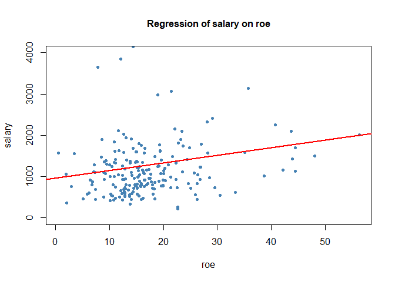<!-- -->

Reproduce Table 2.2 in Wooldridge's text: 

```r
salaryhat <- fitted(results1)
uhat <- resid(results1)
table2.2 <- cbind(roe, salary, salaryhat, uhat)
head(table2.2,n=15)
```

```
##     roe salary salaryhat        uhat
## 1  14.1   1095  1224.058 -129.058071
## 2  10.9   1001  1164.854 -163.854261
## 3  23.5   1122  1397.969 -275.969216
## 4   5.9    578  1072.348 -494.348338
## 5  13.8   1368  1218.508  149.492288
## 6  20.0   1145  1333.215 -188.215063
## 7  16.4   1078  1266.611 -188.610785
## 8  16.3   1094  1264.761 -170.760660
## 9  10.5   1237  1157.454   79.546207
## 10 26.3    833  1449.773 -616.772523
## 11 25.9    567  1442.372 -875.372056
## 12 26.8    933  1459.023 -526.023116
## 13 14.8   1339  1237.009  101.991102
## 14 22.3    937  1375.768 -438.767778
## 15 56.3   2011  2004.808    6.191886
```

# Algebraic properties of OLS estimators

Demonstrate the algebraic properties of OLS estimators: 

1. The sum of the residuals (hence the sample average) is zero 

```r
sum(results1$residuals)
```

```
## [1] -3.17435e-12
```

```r
mean(results1$residuals)
```

```
## [1] -1.525415e-14
```

2. Sample covariance between $x$ and residuals is zero:

```r
sum(results1$residuals*ceosal1$roe)
```

```
## [1] -7.140954e-12
```

```r
cov(results1$residuals, ceosal1$roe)
```

```
## [1] 2.474281e-13
```

3. The point $(\bar{x},\bar{y})$ is always on the regression line: 

```r
roemean <- mean(ceosal1$roe)
salarymean <- mean(ceosal1$salary)
salarymean
```

```
## [1] 1281.12
```

```r
salaryhatmean <- b0hat + b1hat*roemean
salaryhatmean
```

```
## [1] 1281.12
```

4. Sample average of the fitted values is equal to the sample average of observed $y$ values: $\bar{y}=\bar{\hat{y}}$

```r
mean(results1$fitted.values)
```

```
## [1] 1281.12
```

```r
mean(ceosal1$salary)
```

```
## [1] 1281.12
```

Computation of $R^2$ in three ways: 

```r
data(ceosal1, package='wooldridge')

CEOregres <- lm( salary ~ roe, data=ceosal1 )

# Calculate predicted values & residuals:
sal.hat <- fitted(CEOregres)
u.hat <- resid(CEOregres)

# Calculate R^2 in three different ways:
sal <- ceosal1$salary
var(sal.hat) / var(sal)
```

```
## [1] 0.01318862
```

```r
1 - var(u.hat) / var(sal)
```

```
## [1] 0.01318862
```

```r
cor(sal, sal.hat)^2
```

```
## [1] 0.01318862
```


# In-class Example 2: GPA regression


```r
gpareg <- lm(formula = colGPA ~ hsGPA, data = gpa1)
summary(gpareg)
```

```
## 
## Call:
## lm(formula = colGPA ~ hsGPA, data = gpa1)
## 
## Residuals:
##      Min       1Q   Median       3Q      Max 
## -0.85220 -0.26274 -0.04868  0.28902  0.88551 
## 
## Coefficients:
##             Estimate Std. Error t value Pr(>|t|)    
## (Intercept)  1.41543    0.30694   4.611 8.98e-06 ***
## hsGPA        0.48243    0.08983   5.371 3.21e-07 ***
## ---
## Signif. codes:  0 '***' 0.001 '**' 0.01 '*' 0.05 '.' 0.1 ' ' 1
## 
## Residual standard error: 0.34 on 139 degrees of freedom
## Multiple R-squared:  0.1719,	Adjusted R-squared:  0.1659 
## F-statistic: 28.85 on 1 and 139 DF,  p-value: 3.211e-07
```

Obtaining R-squared manually:

```r
# ratio of the variance of fitted values to the variance of x
colGPAhat <- fitted(gpareg)
var(colGPAhat)/var(gpa1$colGPA)
```

```
## [1] 0.1718563
```

```r
# or
cor(colGPAhat, gpa1$colGPA)^2
```

```
## [1] 0.1718563
```

**Exercise**: Write the SRF in equation form. Plot the scatter diagram 
and OLS fitted regression line on the same graph. 


# Example: Wage Regression 

```r
data(wage1, package='wooldridge')

# OLS regression:
WAGEregres <- lm(wage ~ educ, data=wage1)

# obtain coefficients, predicted values and residuals
b.hat <- coef(WAGEregres)
wage.hat <- fitted(WAGEregres)
u.hat <- resid(WAGEregres)

# Algebraic property (1):
mean(u.hat)
```

```
## [1] -1.19498e-16
```

```r
# Algebraic property (2):
cor(wage1$educ , u.hat)
```

```
## [1] 4.349557e-16
```

```r
#Algebraic property (3):
mean(wage1$wage)
```

```
## [1] 5.896103
```

```r
b.hat[1] + b.hat[2] * mean(wage1$educ)
```

```
## (Intercept) 
##    5.896103
```

Regression output: 

```r
summary(WAGEregres)
```

```
## 
## Call:
## lm(formula = wage ~ educ, data = wage1)
## 
## Residuals:
##     Min      1Q  Median      3Q     Max 
## -5.3396 -2.1501 -0.9674  1.1921 16.6085 
## 
## Coefficients:
##             Estimate Std. Error t value Pr(>|t|)    
## (Intercept) -0.90485    0.68497  -1.321    0.187    
## educ         0.54136    0.05325  10.167   <2e-16 ***
## ---
## Signif. codes:  0 '***' 0.001 '**' 0.01 '*' 0.05 '.' 0.1 ' ' 1
## 
## Residual standard error: 3.378 on 524 degrees of freedom
## Multiple R-squared:  0.1648,	Adjusted R-squared:  0.1632 
## F-statistic: 103.4 on 1 and 524 DF,  p-value: < 2.2e-16
```

**Exercise**: Write the SRF in equation form. Interpret the coefficient estimates. 
Interpret the coefficient of determination ($R^2$).  

**Exercise**: Plot the SRF and data values.  


# The importance of data visualization 


```r
library(datasets)
anscombe
```

```
##    x1 x2 x3 x4    y1   y2    y3    y4
## 1  10 10 10  8  8.04 9.14  7.46  6.58
## 2   8  8  8  8  6.95 8.14  6.77  5.76
## 3  13 13 13  8  7.58 8.74 12.74  7.71
## 4   9  9  9  8  8.81 8.77  7.11  8.84
## 5  11 11 11  8  8.33 9.26  7.81  8.47
## 6  14 14 14  8  9.96 8.10  8.84  7.04
## 7   6  6  6  8  7.24 6.13  6.08  5.25
## 8   4  4  4 19  4.26 3.10  5.39 12.50
## 9  12 12 12  8 10.84 9.13  8.15  5.56
## 10  7  7  7  8  4.82 7.26  6.42  7.91
## 11  5  5  5  8  5.68 4.74  5.73  6.89
```


This is the famous "Anscombe's Quartet" (see F.J. Anscombe, 1973, Graphs in Statistical Analysis, The American Statistician, vol.27, No.1, pp.17-21, [click here for pdf version](http://www.jstor.com/stable/2682899)). It is a set of four $x,y$ pairs where $y$ is the dependent variable and $x$ is explanatory variable (($x1,y1$), ($x2,y2$), etc.). First, let's draw scatter diagram of each pair: 


```r
library(ggplot2)
plot1 <- ggplot(anscombe) +
  geom_point(aes(x1, y1)) +
  labs(x="x1", y="y1", title="Dataset 1") +
  theme_classic()
plot1 
```

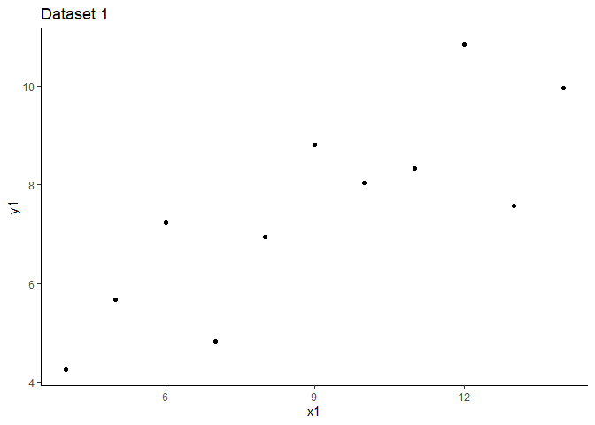<!-- -->


```r
plot2 <- ggplot(anscombe) +
  geom_point(aes(x2, y2)) +
  labs(x="x2", y="y2", title="Dataset 2") +
  theme_classic()
plot2 
```

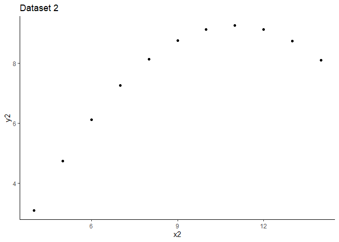<!-- -->

```r
plot3 <- ggplot(anscombe) +
  geom_point(aes(x3, y3)) +
  labs(x="x3", y="y3", title="Dataset 3") +
  theme_classic()
plot3 
```

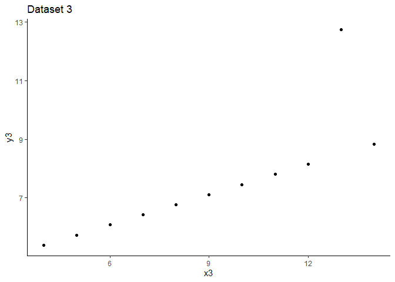<!-- -->


```r
plot4 <- ggplot(anscombe) +
  geom_point(aes(x4, y4)) +
  labs(x="x4", y="y4", title="Dataset 4") +
  theme_classic()
plot4 
```

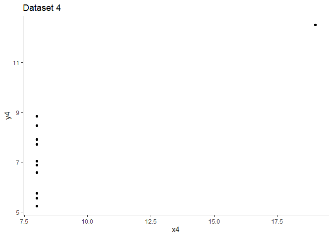<!-- -->

All in one: 


```r
library(grid)
library(gridExtra)
grid.arrange(grobs=list(plot1, plot2, plot3, plot4), 
             ncol=2, top="Anscombe's Quartet")
```

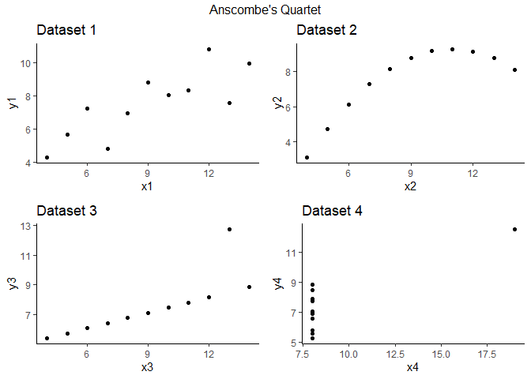<!-- -->

OLS estmation results for each data: 

```r
reg1 <- lm(y1 ~ x1, data = anscombe)
reg1
```

```
## 
## Call:
## lm(formula = y1 ~ x1, data = anscombe)
## 
## Coefficients:
## (Intercept)           x1  
##      3.0001       0.5001
```

```r
reg2 <- lm(y2 ~ x2, data = anscombe)
reg2
```

```
## 
## Call:
## lm(formula = y2 ~ x2, data = anscombe)
## 
## Coefficients:
## (Intercept)           x2  
##       3.001        0.500
```

```r
reg3 <- lm(y3 ~ x3, data = anscombe)
reg3
```

```
## 
## Call:
## lm(formula = y3 ~ x3, data = anscombe)
## 
## Coefficients:
## (Intercept)           x3  
##      3.0025       0.4997
```

```r
reg4 <- lm(y4 ~ x4, data = anscombe)
reg4
```

```
## 
## Call:
## lm(formula = y4 ~ x4, data = anscombe)
## 
## Coefficients:
## (Intercept)           x4  
##      3.0017       0.4999
```

Note that each regression model results in the solution
$$
    \widehat{y} = 3.00 + 0.5~x
$$

Now let's draw the fitted lines together with data points: 

```r
fplot1 <- plot1 + geom_abline(intercept = reg1$coefficients[1], 
                              slope = reg1$coefficients[2], color = "red")
fplot1
```

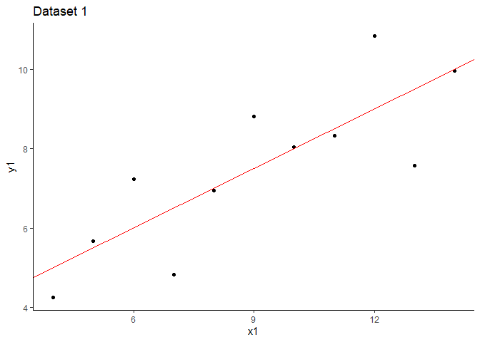<!-- -->


```r
fplot2 <- plot2 + geom_abline(intercept = reg2$coefficients[1], 
                              slope = reg2$coefficients[2], color = "red")
fplot2
```

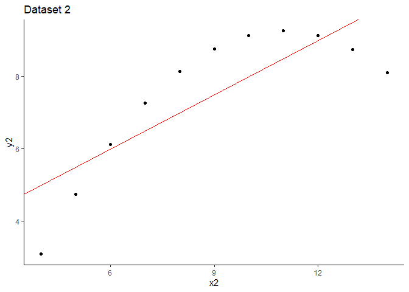<!-- -->

```r
fplot3 <- plot3 + geom_abline(intercept = reg3$coefficients[1], 
                              slope = reg3$coefficients[2], color = "red")
fplot3
```

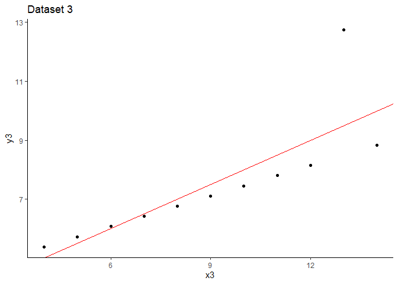<!-- -->


```r
fplot4 <- plot4 + geom_abline(intercept = reg4$coefficients[1], 
                              slope = reg4$coefficients[2], color = "red")
fplot4
```

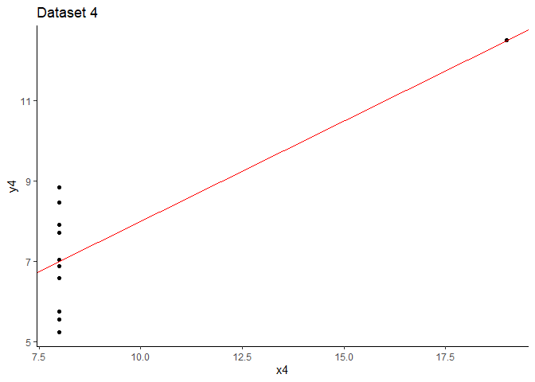<!-- -->

All in one plot: 

```r
library(grid)
library(gridExtra)
grid.arrange(grobs=list(fplot1, fplot2, fplot3, fplot4), 
             ncol=2, top="Anscombe's Quartet")
```

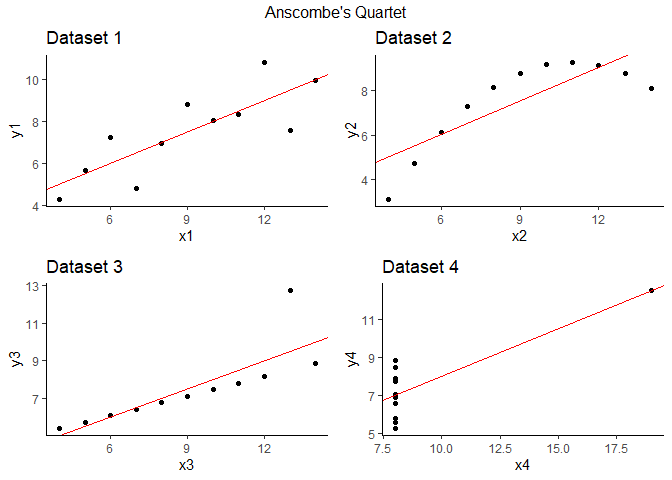<!-- -->

As put succinctly by Anscombe (1973, p.17), graphs help us "perceive and appreciate some broad features of the data" and "let us look behind those broad features and see whate else is there". Based on this fictitious data sets, we can make the following observations: 

Dataset1: linear regression fit passes through the data points and the OLS regression seems to be appropriate here. We note that when we run a linear regression, this is the kind of graph we imagine (read assume) that we have. 

Dataset2: scatter diagram suggests a curved relationship (possibly quadratic) whereas we fitted a linear model. Thus, the fit is inappropriate. 

Dataset3: scatter suggests that there is a linear relationship except for one point which seems to be an outlier. 

Dataset4: this data is peculiar in that all $x$ values fall in one point except one at the right corner. If that observation is dropped there would be no variation in $x$. Can we estimate the slope parameter in this case? 

**Exercise:** For each of the Anscombe's quartet, plot residuals against $x$. Interpret. 

<div class="tocify-extend-page" data-unique="tocify-extend-page" style="height: 0;"></div>
