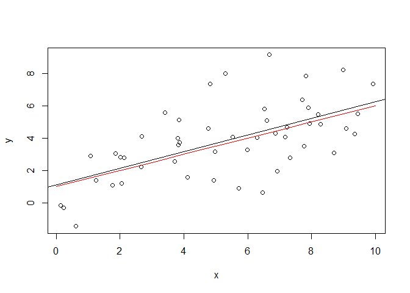

<style type="text/css"> 
body{
  font-size: 12pt;
}
code.r{
  font-size: 12pt;
}
</style>


# In-class Example: Wage-Education Model (log-level)

```r
library(wooldridge)
data(wage1)
```

Estimate a simple regression of log wage on educ.
\[
    log(wage) = \beta_0 + \beta_1 educ + u
\]

Variable definitions are as follows:     
wage: hourly wage (US$), educ: education level in years.

We can use `lm()` function to run the regression in R: 

```r
wagereg <- lm(log(wage) ~ educ, data = wage1)
# View(wagereg)
summary(wagereg) 
```

```
## 
## Call:
## lm(formula = log(wage) ~ educ, data = wage1)
## 
## Residuals:
##      Min       1Q   Median       3Q      Max 
## -2.21158 -0.36393 -0.07263  0.29712  1.52339 
## 
## Coefficients:
##             Estimate Std. Error t value Pr(>|t|)    
## (Intercept) 0.583773   0.097336   5.998 3.74e-09 ***
## educ        0.082744   0.007567  10.935  < 2e-16 ***
## ---
## Signif. codes:  0 '***' 0.001 '**' 0.01 '*' 0.05 '.' 0.1 ' ' 1
## 
## Residual standard error: 0.4801 on 524 degrees of freedom
## Multiple R-squared:  0.1858,	Adjusted R-squared:  0.1843 
## F-statistic: 119.6 on 1 and 524 DF,  p-value: < 2.2e-16
```

This can be written in equation form as follows: 
\[
    \widehat{log(wage)} = 0.584 + 0.083 educ
\]

Here is the scatter plot of the data points and the sample regression line: 

```r
plot(wage1$educ, wage1$lwage,
     col = "steelblue",
     pch = 20,
     main = "Log-level Regression Fit", 
     cex.main = 1)
abline(wagereg, 
       col = "red", 
       lwd = 2)
```

<!-- -->

Compare this to level-level model: 

```r
wagereg2 <- lm(wage ~ educ, data = wage1)
# View(wagereg2)
summary(wagereg2) 
plot(wage1$educ, wage1$wage,
     col = "steelblue",
     pch = 20,
     main = "Level-level Regression Fit", 
     cex.main = 1)
abline(wagereg2, 
       col = "red", 
       lwd = 2)
```

<!-- -->

```
## 
## Call:
## lm(formula = wage ~ educ, data = wage1)
## 
## Residuals:
##     Min      1Q  Median      3Q     Max 
## -5.3396 -2.1501 -0.9674  1.1921 16.6085 
## 
## Coefficients:
##             Estimate Std. Error t value Pr(>|t|)    
## (Intercept) -0.90485    0.68497  -1.321    0.187    
## educ         0.54136    0.05325  10.167   <2e-16 ***
## ---
## Signif. codes:  0 '***' 0.001 '**' 0.01 '*' 0.05 '.' 0.1 ' ' 1
## 
## Residual standard error: 3.378 on 524 degrees of freedom
## Multiple R-squared:  0.1648,	Adjusted R-squared:  0.1632 
## F-statistic: 103.4 on 1 and 524 DF,  p-value: < 2.2e-16
```


# In-class Example: Test Score and Regional Income (Level-log )

1. Estimate a simple regression of test scores on income (level-level).
\[
    Test~ Score = \beta_0 + \beta_1 Income + u
\]

Variable definitions are as follows:     
Test score: average student performance on a standardized test in a district; Income: income level at the district level (1000 US$). 


```r
# Install the AER package if you haven't done so. 
# install.packages("AER")
library(AER)                                                     
```

```
## Loading required package: car
```

```
## Loading required package: carData
```

```
## Loading required package: lmtest
```

```
## Loading required package: zoo
```

```
## 
## Attaching package: 'zoo'
```

```
## The following objects are masked from 'package:base':
## 
##     as.Date, as.Date.numeric
```

```
## Loading required package: sandwich
```

```
## Loading required package: survival
```

```r
data(CASchools)
# prepare variables
CASchools$size <- CASchools$students/CASchools$teachers
CASchools$score <- (CASchools$read + CASchools$math) / 2       

# fit a level-level model 
linear_model<- lm(score ~ income, data = CASchools)
summary(linear_model)

# plot the observations
plot(CASchools$income, CASchools$score,
     col = "steelblue",
     pch = 20,
     xlab = "District Income (thousands of dollars)", 
     ylab = "Test Score",
     cex.main = 0.9,
     main = "Test Score vs. District Income", 
     cex.main = 1)

# add the regression line to the plot
abline(linear_model, 
       col = "red", 
       lwd = 2)
```

<!-- -->

```
## 
## Call:
## lm(formula = score ~ income, data = CASchools)
## 
## Residuals:
##     Min      1Q  Median      3Q     Max 
## -39.574  -8.803   0.603   9.032  32.530 
## 
## Coefficients:
##             Estimate Std. Error t value Pr(>|t|)    
## (Intercept) 625.3836     1.5324  408.11   <2e-16 ***
## income        1.8785     0.0905   20.76   <2e-16 ***
## ---
## Signif. codes:  0 '***' 0.001 '**' 0.01 '*' 0.05 '.' 0.1 ' ' 1
## 
## Residual standard error: 13.39 on 418 degrees of freedom
## Multiple R-squared:  0.5076,	Adjusted R-squared:  0.5064 
## F-statistic: 430.8 on 1 and 418 DF,  p-value: < 2.2e-16
```

**Exercise**: Write the SRF in equation form and interpret the results. Is it a good fit? 

2. Now, estimate a level-log model: 

```r
LevelLog_model <- lm(score ~ log(income), data = CASchools)

# draw a scatterplot
plot(score ~ log(income), 
     col = "steelblue",
     pch = 20,
     data = CASchools,
     main = "Level-Log Regression Fit", 
     cex.main = 1)
abline(LevelLog_model, 
       col = "red", 
       lwd = 2)
```

<!-- -->

```r
# Income in original levels (1000 US$)
# and add regression fitted values 
plot(score ~ income, 
     col = "steelblue",
     pch = 20,
     data = CASchools,
     main = "Level-Log Regression Fit", 
     cex.main = 1)

# add the linear-log regression line
order_id  <- order(CASchools$income)

lines(CASchools$income[order_id],
      fitted(LevelLog_model)[order_id], 
      col = "red", 
      lwd = 2)
```

<!-- -->


# In-class Example: CEO salary and firm performance (Log-log ):

Estimate a simple regression of log salary on log sales.
\[
    log(salary) = \beta_0 + \beta_1 log(sales) + u
\]

R code: 

```r
LogLog_model <- lm(log(salary) ~ log(sales), data = ceosal1)
# View(LogLog_model)
summary(LogLog_model) 
```

```
## 
## Call:
## lm(formula = log(salary) ~ log(sales), data = ceosal1)
## 
## Residuals:
##      Min       1Q   Median       3Q      Max 
## -1.01038 -0.28140 -0.02723  0.21222  2.81128 
## 
## Coefficients:
##             Estimate Std. Error t value Pr(>|t|)    
## (Intercept)  4.82200    0.28834  16.723  < 2e-16 ***
## log(sales)   0.25667    0.03452   7.436  2.7e-12 ***
## ---
## Signif. codes:  0 '***' 0.001 '**' 0.01 '*' 0.05 '.' 0.1 ' ' 1
## 
## Residual standard error: 0.5044 on 207 degrees of freedom
## Multiple R-squared:  0.2108,	Adjusted R-squared:  0.207 
## F-statistic:  55.3 on 1 and 207 DF,  p-value: 2.703e-12
```

Write the output in equation form.
$$ \widehat{log(salary)} = 4.822  + 0.257~~ log(sales)  $$
Draw the scatter plot and 
super-impose the log-log regression fitted values:


```r
plot(log(salary) ~ log(sales), 
     col = "steelblue",
     pch = 20,
     data = ceosal1,
     main = "Log-Log Regression Fit", 
     cex.main = 1)
abline(LogLog_model, 
       col = "red", 
       lwd = 2)
```

<!-- -->

**Exercise**: Now, run the level-level regression and draw a similar plot. Compare it to the log-log model. 


# Sampling Distributions of OLS Estimators: Simulation Experiment

## Population vs. Sample Regression Function

Population regression function (PRF) is given by
$$ y_i = \beta_0 + \beta_1 x_i + u_i $$
Sample regression functon (SRF)
$$ y_i = \hat{\beta}_0 + \hat{\beta}_1 x_i + \hat{u}_i = \hat{y}_i + \hat{u}_i $$
for each $i=1,2,\ldots,n$. 

Now, let's assume that we know the PRF. More specifically, let $\beta_0=1$, $\beta_1=0.5$ and $u\sim~N(0,\sigma^2)$ where $\sigma = 2$, that is, 

$$ y_i = 1 + 0.5~ x_i + u_i, ~~~u_i\sim~N(0,4) $$
Also, we assume that $x$ follows a uniform distribution between 0 and 10, i.e., $X\sim~Unif(0,10)$. Under these settings, we can easily simulate a random sample from the PRF. For example, 

```r
# Set the random seed to obtain the same results
set.seed(1) 
n     <- 50      # set sample size  
beta0 <- 1       # true betas in the PRF
beta1 <- 0.5 
su    <- 2       # set the std dev of the error term
x     <- runif(n, min = 0, max = 10) # draw a random sample of X
u     <- rnorm(n, mean = 0, sd = su) # draw a random sample of errors 
y     <- beta0 + beta1*x + u         # draw a random sample of Y
```

The conditional expectation of $y$ given $x$ is 
$$ E(y|X=x) =  \beta_0 + \beta_1x$$

For example, let $x=4$, then 
$$ E(y|X=4) =  1+0.5\times 4 = 3$$

Because $u$ follows a normal distribution with mean 0 and variance 4, the conditional distribution of $y$ is also normal with mean  $E(y|X=x) =  \beta_0 + \beta_1x$ and variance 4. In other words, under the normality of $u$ we have (more on this later)
$$y|x\sim~N(\beta_0 + \beta_1x,~\sigma^2)$$


For a set of representative values, we can visualize the PRF as follows: 

```r
# set x values to draw the PRF
xrep <- c(2,4,6,8)
# Conditional expectation given x
Ey <- beta0 + beta1 * xrep 
# draw the vertical conditional densities using vert_dens() function
plot(NULL, xlim=c(0,10), ylim=c(-3,10), ylab="y", xlab="x")
vert_dens(2,2,sd=su,height=0.9)
vert_dens(4,3,sd=su,height=0.9)
vert_dens(6,4,sd=su,height=0.9)
vert_dens(8,5,sd=su,height=0.9)
points(xrep, Ey, col = "red", cex = 1) 
# connecting the conditional means we obtain the population regression function
lines(c(0:10),beta0+beta1*c(0:10), col="red") 
legend(0,10,c("PRF"), lty = 1, col = "red")
```

<!-- -->

In the plot above, the red line is the PRF which connects the conditional means of $y$ in the population. Let's draw a scatter plot of the random sample that we've drawn previously from the PRF above: 

```r
xrep <- c(0:10)
Ey <- beta0 + beta1 * xrep
plot(x,y)
points(xrep, Ey, type = "l", col = "red", ylab = "y") 
```

<!-- -->

Running the OLS regression on our first random sample, we obtain: 

```r
SRF1 <- lm(y ~ x)
SRF1
```

```
## 
## Call:
## lm(formula = y ~ x)
## 
## Coefficients:
## (Intercept)            x  
##      1.1254       0.5136
```

The SRF is given by 
$$ \hat{y}_i = 1.125 + 0.514 x_i   $$

Let's draw this together with the PRF: 

```r
xrep <- c(0:10)
Ey <- beta0 + beta1 * xrep
plot(x,y)
points(xrep, Ey, type = "l", col = "red", ylab = "y") 
abline(SRF1) 
```

<!-- -->

Draw another sample: 

```r
x2     <- runif(n, min = 0, max = 10) # draw a random sample of X
u2     <- rnorm(n, mean = 0, sd = su) # draw a random sample of errors 
y2     <- beta0 + beta1*x2 + u2         # draw a random sample of Y
plot(x2,y2)
```

<!-- -->

Run the OLS regression on the new sample: 

```r
SRF2 <- lm(y2 ~ x2)
SRF2
```

```
## 
## Call:
## lm(formula = y2 ~ x2)
## 
## Coefficients:
## (Intercept)           x2  
##      1.0702       0.4299
```

```r
xrep <- c(0:10)
Ey <- beta0 + beta1 * xrep
plot(x2,y2)
points(xrep, Ey, type = "l", col = "red", ylab = "y") 
abline(SRF2)
```

<!-- -->

We can: Repeat this process a large number of times, save the coefficient estimates and inspect their distribution. This is called a simulation experiment. 

## Simulating the Sampling Distribution of OLS estimator

To replicate the Monte Carlo simulation experiment that we saw 
in class, run the the file `SLR_simulation1.R`.


```r
# Set the random seed
# So that we will obtain the same results 
# Otherwise, simulation results will change 
set.seed(1234567)

# set sample size 
n <- 50 
# the number of simulations
MCreps <- 10000

# set true parameters: betas and standard deviation of u
beta0 <- 1 
beta1 <- 0.5 
su <- 2

# initialize b0hat and b1hat to store results later:
b0hat <- numeric(MCreps)
b1hat <- numeric(MCreps)

# Draw a sample of x 
# this is going to be fixed in repeated samples 
x <- 10*runif(n,0,1)

# repeat MCreps times:
for(i in 1:MCreps) {
  print(i)
  # Draw a sample of y:
  u <- rnorm(n,0,su)
  y <- beta0 + beta1*x + u
  # estimate parameters by OLS and store them in the vectors
  bhat <- coefficients( lm(y~x) )
  b0hat[i] <- bhat["(Intercept)"]
  b1hat[i] <- bhat["x"]
}
# draw histogram and summary statistics
hist(b0hat)
```


```r
summary(b0hat)
mean(b0hat)
sd(b0hat)

hist(b1hat)
```


```r
summary(b1hat)
mean(b1hat)
sd(b1hat)

# smoothed histogram 
hist(b1hat, freq = FALSE, breaks=seq(0,1,0.025), axes = FALSE) 
axis(1,at = seq(0,1,0.1),labels = TRUE,pos = 0)
axis(2,pos = 0)
lines(density(b1hat), lwd=2, col="blue")
```


```r
hist(b0hat, freq = FALSE, breaks=seq(-2,4,0.1), axes = FALSE) 
axis(1,at = seq(-1,3,1),labels = TRUE,pos = 0)
axis(2,pos = -2)
lines(density(b0hat), lwd=2, col="blue")
```


<div class="tocify-extend-page" data-unique="tocify-extend-page" style="height: 0;"></div>


