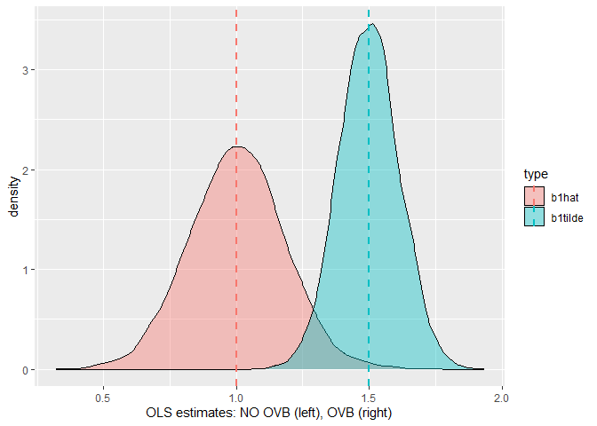

<style type="text/css"> 
body{
  font-size: 12pt;
}
code.r{
  font-size: 12pt;
}
</style>


# Estimation of Multiple Linear Regression Model in R

The population regression model given by
  \[
        y = \beta_0 + \beta_1 x_1 + \beta_2 x_2 + \ldots + \beta_k x_k + u
  \]
can be estimated by the command

```r
lm(formula = y ~ x1 + x2 + ... + xk, options)
```
or just

```r
lm(y ~ x1 + x2 + ... + xk, options)
```
Note that the intercept is automatically added to the model. If you want to run 
a regression without a constant term (you should consider twice before doing that) you can use 

```r
lm(y ~ 0 + x1 + x2 + ... + xk, options)
```
The  ` lm() ` command accepts several options regarding the specification. See the help 
files. 

As we've already seen many times, if you want the results to be stored and 
displayed in a table format you can use 

```r
res <- lm(y ~ 0 + x1 + x2 + ... + xk, options)
summary(res)
```


## Example 1: College GPA

```r
library(wooldridge)
GPAres <- lm(colGPA ~ hsGPA+ACT, data=gpa1)
summary(GPAres)
```

```
## 
## Call:
## lm(formula = colGPA ~ hsGPA + ACT, data = gpa1)
## 
## Residuals:
##      Min       1Q   Median       3Q      Max 
## -0.85442 -0.24666 -0.02614  0.28127  0.85357 
## 
## Coefficients:
##             Estimate Std. Error t value Pr(>|t|)    
## (Intercept) 1.286328   0.340822   3.774 0.000238 ***
## hsGPA       0.453456   0.095813   4.733 5.42e-06 ***
## ACT         0.009426   0.010777   0.875 0.383297    
## ---
## Signif. codes:  0 '***' 0.001 '**' 0.01 '*' 0.05 '.' 0.1 ' ' 1
## 
## Residual standard error: 0.3403 on 138 degrees of freedom
## Multiple R-squared:  0.1764,	Adjusted R-squared:  0.1645 
## F-statistic: 14.78 on 2 and 138 DF,  p-value: 1.526e-06
```
SRF in equation form (standard errors are in parentheses): 
\[
 \widehat{colGPA} = \underset{(0.341)} {1.29} + \underset{(0.096)} {0.453}~ hsGPA + \underset{(0.011)} {0.0094}~ ACT
 \]
 $n=141$ students, $colGPA$: university grade point average (GPA, points out of 4), $hsGPA$: high school grade point average, $ACT$: achievement test score.

## Example 2: Wage Equation

```r
summary( lm(log(wage) ~ educ+exper+tenure, data=wage1) )
```

```
## 
## Call:
## lm(formula = log(wage) ~ educ + exper + tenure, data = wage1)
## 
## Residuals:
##      Min       1Q   Median       3Q      Max 
## -2.05802 -0.29645 -0.03265  0.28788  1.42809 
## 
## Coefficients:
##             Estimate Std. Error t value Pr(>|t|)    
## (Intercept) 0.284360   0.104190   2.729  0.00656 ** 
## educ        0.092029   0.007330  12.555  < 2e-16 ***
## exper       0.004121   0.001723   2.391  0.01714 *  
## tenure      0.022067   0.003094   7.133 3.29e-12 ***
## ---
## Signif. codes:  0 '***' 0.001 '**' 0.01 '*' 0.05 '.' 0.1 ' ' 1
## 
## Residual standard error: 0.4409 on 522 degrees of freedom
## Multiple R-squared:  0.316,	Adjusted R-squared:  0.3121 
## F-statistic: 80.39 on 3 and 522 DF,  p-value: < 2.2e-16
```

## Example 3: Crime Model

```r
# Model without avgsen:
summary( lm(narr86 ~ pcnv+ptime86+qemp86, data=crime1) )
```

```
## 
## Call:
## lm(formula = narr86 ~ pcnv + ptime86 + qemp86, data = crime1)
## 
## Residuals:
##     Min      1Q  Median      3Q     Max 
## -0.7118 -0.4031 -0.2953  0.3452 11.4358 
## 
## Coefficients:
##              Estimate Std. Error t value Pr(>|t|)    
## (Intercept)  0.711772   0.033007  21.565  < 2e-16 ***
## pcnv        -0.149927   0.040865  -3.669 0.000248 ***
## ptime86     -0.034420   0.008591  -4.007 6.33e-05 ***
## qemp86      -0.104113   0.010388 -10.023  < 2e-16 ***
## ---
## Signif. codes:  0 '***' 0.001 '**' 0.01 '*' 0.05 '.' 0.1 ' ' 1
## 
## Residual standard error: 0.8416 on 2721 degrees of freedom
## Multiple R-squared:  0.04132,	Adjusted R-squared:  0.04027 
## F-statistic:  39.1 on 3 and 2721 DF,  p-value: < 2.2e-16
```
Write down the SRF in equation form. Interpret the coefficient estimates. 

```r
# Model with avgsen:
summary( lm(narr86 ~ pcnv+avgsen+ptime86+qemp86, data=crime1) )
```

```
## 
## Call:
## lm(formula = narr86 ~ pcnv + avgsen + ptime86 + qemp86, data = crime1)
## 
## Residuals:
##     Min      1Q  Median      3Q     Max 
## -0.9330 -0.4247 -0.2934  0.3506 11.4403 
## 
## Coefficients:
##              Estimate Std. Error t value Pr(>|t|)    
## (Intercept)  0.706756   0.033151  21.319  < 2e-16 ***
## pcnv        -0.150832   0.040858  -3.692 0.000227 ***
## avgsen       0.007443   0.004734   1.572 0.115993    
## ptime86     -0.037391   0.008794  -4.252 2.19e-05 ***
## qemp86      -0.103341   0.010396  -9.940  < 2e-16 ***
## ---
## Signif. codes:  0 '***' 0.001 '**' 0.01 '*' 0.05 '.' 0.1 ' ' 1
## 
## Residual standard error: 0.8414 on 2720 degrees of freedom
## Multiple R-squared:  0.04219,	Adjusted R-squared:  0.04079 
## F-statistic: 29.96 on 4 and 2720 DF,  p-value: < 2.2e-16
```

# Imperfect Multicollinearity: Variance Inflation Factors (VIF)

In class we saw that the variance of OLS estimators can be written as 
\[
Var(\hat{\beta}_j)=\frac{\sigma^2}{SST_j(1-R_j^2)},~~j=1,2,\ldots,k
\]
where
\[
SST_j = \sum_{i=1}^n (x_{ij}-\bar{x}_j)^2
\]
is the total sample variation in $x_j$ and $R_j^2$ is the R-squared from regressing $x_j$ on all other independent variables (including an intercept term). The variance inflation factor (VIF) is defined as follows 
\[
VIF_j =\frac{1}{(1-R_j^2)},~~j=1,2,\ldots,k
\]

As an example consider the college GPA regression 

```r
# Full estimation results including automatic SE :
res <- lm(colGPA ~ hsGPA+ACT, data=gpa1)
summary(res)
```

```
## 
## Call:
## lm(formula = colGPA ~ hsGPA + ACT, data = gpa1)
## 
## Residuals:
##      Min       1Q   Median       3Q      Max 
## -0.85442 -0.24666 -0.02614  0.28127  0.85357 
## 
## Coefficients:
##             Estimate Std. Error t value Pr(>|t|)    
## (Intercept) 1.286328   0.340822   3.774 0.000238 ***
## hsGPA       0.453456   0.095813   4.733 5.42e-06 ***
## ACT         0.009426   0.010777   0.875 0.383297    
## ---
## Signif. codes:  0 '***' 0.001 '**' 0.01 '*' 0.05 '.' 0.1 ' ' 1
## 
## Residual standard error: 0.3403 on 138 degrees of freedom
## Multiple R-squared:  0.1764,	Adjusted R-squared:  0.1645 
## F-statistic: 14.78 on 2 and 138 DF,  p-value: 1.526e-06
```
Compute the standard error of regression (SER) and the VIF: 

```r
# Extract SER (instead of calculation via residuals)
( SER <- summary(res)$sigma )
```

[1] 0.3403158

```r
# regressing hsGPA on ACT for calculation of R2 & VIF
( R2.hsGPA  <- summary( lm(hsGPA~ACT, data=gpa1) )$r.squared )
```

[1] 0.1195815

```r
( VIF.hsGPA <- 1/(1-R2.hsGPA) )
```

[1] 1.135823

```r
# manual calculation of SE of hsGPA coefficient:
n <- nobs(res)
sdx <- sd(gpa1$hsGPA) * sqrt((n-1)/n)  # (Note: sd() uses the (n-1) version)
( SE.hsGPA <- 1/sqrt(n) * SER/sdx  * sqrt(VIF.hsGPA) )
```

[1] 0.09581292

$VIF_j$ measures the degree to which the variance is inflated due to the correlation of $x_j$ with other regressors in the model. 

Automatic Calculation of VIFs: 

```r
# OLS regression:
lmres <- lm(log(wage) ~ educ+exper+tenure, data=wage1)

# Regression output:
summary(lmres)
```

```
## 
## Call:
## lm(formula = log(wage) ~ educ + exper + tenure, data = wage1)
## 
## Residuals:
##      Min       1Q   Median       3Q      Max 
## -2.05802 -0.29645 -0.03265  0.28788  1.42809 
## 
## Coefficients:
##             Estimate Std. Error t value Pr(>|t|)    
## (Intercept) 0.284360   0.104190   2.729  0.00656 ** 
## educ        0.092029   0.007330  12.555  < 2e-16 ***
## exper       0.004121   0.001723   2.391  0.01714 *  
## tenure      0.022067   0.003094   7.133 3.29e-12 ***
## ---
## Signif. codes:  0 '***' 0.001 '**' 0.01 '*' 0.05 '.' 0.1 ' ' 1
## 
## Residual standard error: 0.4409 on 522 degrees of freedom
## Multiple R-squared:  0.316,	Adjusted R-squared:  0.3121 
## F-statistic: 80.39 on 3 and 522 DF,  p-value: < 2.2e-16
```

```r
# Load package "car" (has to be installed):
library(car)
```

```
## Loading required package: carData
```

```r
# Automatically calculate VIF :
vif(lmres)
```

    educ    exper   tenure 
1.112771 1.477618 1.349296 

**Rule of Thumb**: If the maximum $VIF_j$ is larger 10, then there may be (imperfect) collinearity in our regression. Because the largest VIF is less than 10 in our example we may be confident that there is no evidence of collinearity problem. 

# Omitted Variable Bias (OVB)
Let the true model be 
 $$
    y = \beta_0 + \beta_1 x_1 + \beta_2 x_2 + u
 $$

Assume that $x_2$ is omitted. Estimated regression is 
 $$
    \tilde{y }= \tilde{\beta}_0 + \tilde{\beta}_1 x_1
 $$
In class, we showed that the OLS estimator on $x_1$ is biased. In fact, the bias can theoretically be computed using 
 $$
 bias = E(\tilde{\beta}_1) - \beta_1 = \beta_2\tilde{\delta}_1
 $$
where 
 $$
 \tilde{x}_2 = \tilde{\delta}_0 + \tilde{\delta}_1 x_1
 $$
 
We can demonstrate the average bias by means of a Monte Carlo experiment. 
Let the true values of parameters be 
 $$
\beta_0 = 0, ~~\beta_1 = 1, ~~\beta_2=1, ~~\delta_0=0, ~~\delta_1=0.5
 $$
These values imply that 
 $$
  E(\tilde{\beta}_1) = \beta_1 + \beta_2\tilde{\delta}_1 = 1+ 1\times 0.5=1.5
 $$
 and
 $$
 bias =  \beta_2\tilde{\delta}_1 = 1\times 0.5 = 0.5
 $$

R code (also see MLR_simulation.R script)

```r
# Set the random seed
# So that we will obtain the same results 
# Otherwise, simulation results will change 
set.seed(1234567)

# set sample size 
n <- 50 
# the number of simulations
MCreps <- 10000

# TRUE MODEL: y = beta0 + beta1 x1 + beta2 x2 + u
# ESTIMATED MODEL: y = b0tilde + b1tilde x1 + v 
# note that v = beta2 x2 + u
# Also: x2 = delta0 + delta1 x1 + epsilon 
#
# set true parameters: betas and sd of u
beta0 <- 0 
beta1 <- 1 
beta2 <- 1
su <- 2
delta0 <- 0 
delta1 <- 0.5 
sepsilon <- 1 

# initialize coefficient estimates to store results 
b0tilde <- numeric(MCreps)
b1tilde <- numeric(MCreps)
b0hat <- numeric(MCreps)
b1hat <- numeric(MCreps)

# Draw a sample of x1  
x1 <- 10*runif(n,0,1)

# repeat MCreps times:
for(i in 1:MCreps) {
  print(i)
  # Draw a sample of x1  
  x1 <- 10*runif(n,0,1)
  # Draw a sample of x2  
  x2 <- delta0 + delta1*x1 + rnorm(n,0,sepsilon)
  
  # Draw a sample of y:
  u <- rnorm(n,0,su)
  y <- beta0 + beta1*x1 + beta2*x2 + u
  # estimate parameters by OLS and store them in the vectors
  # case 1: OV
  bhat <- coefficients( lm(y ~ x1) )
  b0tilde[i] <- bhat["(Intercept)"]
  b1tilde[i] <- bhat["x1"]
  # case 2: No OV
  bhat2 <- coefficients( lm(y ~ x1 + x2) )
  b0hat[i] <- bhat2["(Intercept)"]
  b1hat[i] <- bhat2["x1"]
}

# smoothed histogram  
# create a data set consisting of betahats and betatildes
df <- data.frame(
  type=factor(rep(c("b1tilde", "b1hat"), each=MCreps)),
  bhat= c(b1tilde, b1hat) 
)

# compute group means 
library(plyr)
```

```
## Warning: package 'plyr' was built under R version 3.6.3
```

```r
dfmean <- ddply(df, "type", summarise, bhat.mean=mean(bhat))

# draw smoothed histogram using ggplot2
library(ggplot2)
```

```
## Warning: package 'ggplot2' was built under R version 3.6.3
```

```r
ggplot(df,aes(x=bhat, fill=type)) + geom_density(alpha=0.4) + 
  geom_vline(data=dfmean, aes(xintercept=bhat.mean,  colour=type),
             linetype="dashed", size=1) + 
  labs(x = "OLS estimates: NO OVB (left), OVB (right)")
```



Summary statistics: 

```r
# summary statistics
summary(b0tilde)
```

     Min.   1st Qu.    Median      Mean   3rd Qu.      Max. 
-2.479504 -0.431475  0.013752  0.009631  0.450177  2.587063 

```r
summary(b0hat)
```

     Min.   1st Qu.    Median      Mean   3rd Qu.      Max. 
-2.343695 -0.388299  0.007779  0.001985  0.395953  2.224228 

```r
summary(b1tilde)
```

   Min. 1st Qu.  Median    Mean 3rd Qu.    Max. 
  1.103   1.423   1.499   1.499   1.574   1.930 

```r
summary(b1hat)
```

   Min. 1st Qu.  Median    Mean 3rd Qu.    Max. 
 0.3216  0.8825  1.0031  1.0020  1.1203  1.6986 


<div class="tocify-extend-page" data-unique="tocify-extend-page" style="height: 0;"></div>


