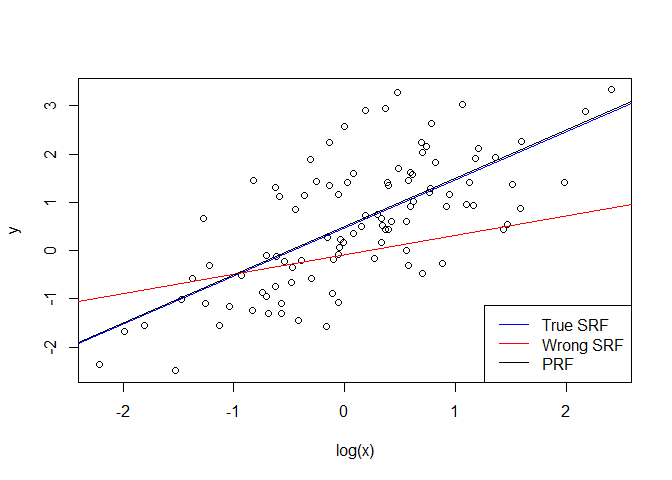
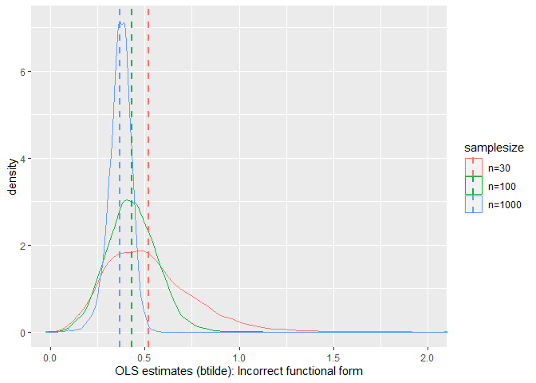
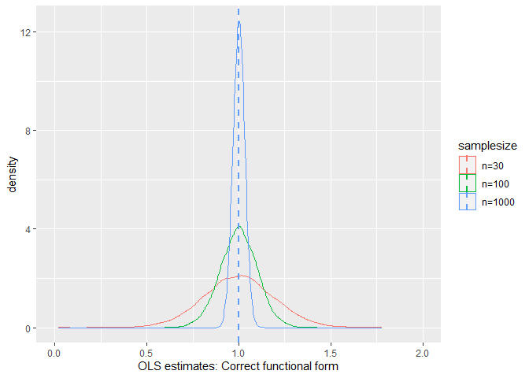
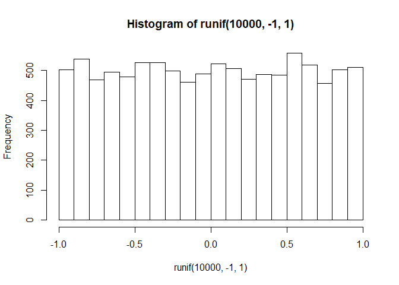
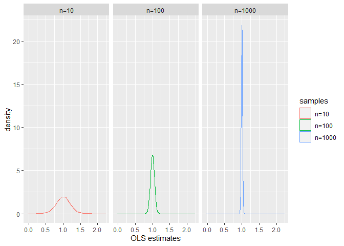
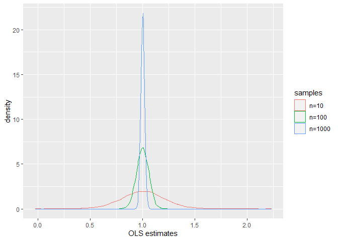
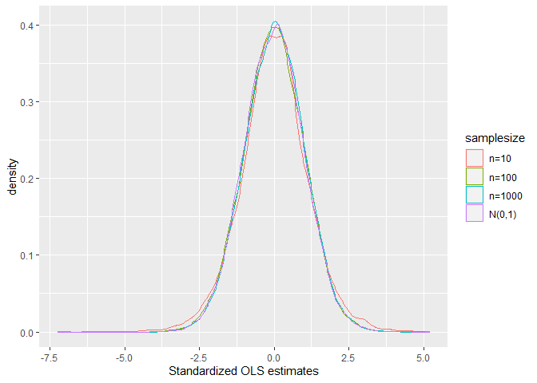
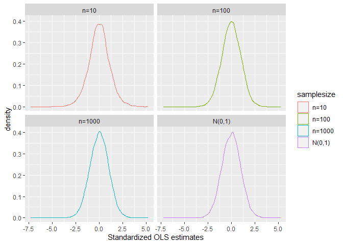

<style type="text/css"> 
body{
  font-size: 12pt;
}
code.r{
  font-size: 12pt;
}
</style>


# Consistency

Asymptotic properties are also called large sample properties. There are two fundamental large sample properties of estimators: consistency and asymptotic normality. Consistency tells us that as we collect more and more information (i.e., data) the OLS estimator converges to the true (unknown) value. As you learned in class, there are a set of assumptions required for that to happen. The most critical one is that the error term must be uncorrelated with all $x$ variables in the model: 
$$
Cov(x_j, u) = 0,~~~for~ all~ j=1,2,\ldots,k
$$
This assumption can easily fail if there are important omitted factors, functional form misspecification, certain types of measurement errors in explanatory variables, reverse causality, etc. 

OLS estimator can be inconsistent. This means that no matter how large your data set is, OLS on average gives you the wrong answer.In other words, it is still biased in large samples. Collecting more data does not solve the endogeneity problem. 

To illustrate this property let's consider a simulation experiment. The true relationship is nonlinear in $x$ and given by 
$$
y = \beta_0 + \beta_1 \log(x) + u
$$
where the true values of parameters are $\beta_0=0.5$ and $\beta_1=1$. But the researcher fits the following model instead: 
$$
y = \beta_0 +\beta_1 x + u
$$
This is similar to the omitted variable problem we saw in our previous classes. This will create bias in finite samples. Is OLS consistent? In other words, can we get asymptotically unbiased estimator as we increase the sample size?

The code below simulates a single data set and then runs correctly specified and misspecified OLS regressions. As can be seen from the figure, correctly specified SRF (shown in blue) is much closer to the Population Regression Function (PRF, shown in black). Misspecified model (shown in red) has a much smaller slope for this sample. 

```r
set.seed(1)
x <- exp(rnorm(100, 0, 1))
u <- rnorm(100, 0, 1)
y <- 0.5 + log(x) + u
model1 <- lm(y ~ log(x))
model2 <- lm(y ~ x)
plot(log(x),y)
abline(model1, col="blue")
abline(model2, col="red")
abline(a = 0.5, b=1)
legend("bottomright",c("True SRF", "Wrong SRF", "PRF"), col = c("blue", "red", "black"), lty = 1)
```

<!-- -->


We will consider three sample sizes: $n=30$, $n=100$, and $n=1000$. We will simulate 
artificial data for each sample size and replicate it 10000 times and inspect the resulting sampling distributions. 


```r
# Demonstrate inconsistency

# set sample sizes
n <- c(30, 100, 1000) 
set.seed(1357987) 
# set true values
b0 <- 0.5 
b1 <- 1

# set the number of replications
reps <- 10000

# create a zeros matrix of size reps x ncol of n
# this is a placeholder to be filled in the double loop below
b1hat <- matrix(data = 0, nrow = reps, ncol = length(n))
b1tilde <- matrix(data = 0, nrow = reps, ncol = length(n))

# loop over both the number of obs and reps
for(j in 1:length(n)) {
  for(i in 1:reps) {
    x <- exp(rnorm(n[j], 0, 1))
    u <- rnorm(n[j], 0, 1)
    y <- b0 + b1*log(x) + u
    bhat <- coef( lm(y ~ log(x) ) )
    b1hat[i,j] <- bhat["log(x)"]
    btilde <- coef( lm(y ~ x) )
    b1tilde[i,j] <- btilde["x"]
  }
}

bhat= c(b1hat[,1], b1hat[,2],b1hat[,3]) 
btilde = c(b1tilde[,1], b1tilde[,2],b1tilde[,3])
nobs = rep(c(1, 2, 3), each=reps)
samplesize = factor(nobs, labels=c("n=30", "n=100", "n=1000"))
df <- data.frame(samplesize, bhat,btilde)

# compute group means 
library(dplyr)
```

```
## Warning: package 'dplyr' was built under R version 3.6.3
```

```
## 
## Attaching package: 'dplyr'
```

```
## The following objects are masked from 'package:stats':
## 
##     filter, lag
```

```
## The following objects are masked from 'package:base':
## 
##     intersect, setdiff, setequal, union
```

```r
library(ggplot2)
```

```
## Warning: package 'ggplot2' was built under R version 3.6.3
```

```r
dfmean <- df %>% group_by(samplesize) %>% 
  summarize(bhat_mean = mean(bhat), bhat_sd = sd(bhat), 
            btilde_mean = mean(btilde), btilde_sd = sd(btilde))
dfmean
```

```
## # A tibble: 3 x 5
##   samplesize bhat_mean bhat_sd btilde_mean btilde_sd
##   <fct>          <dbl>   <dbl>       <dbl>     <dbl>
## 1 n=30           1.00   0.193        0.522    0.229 
## 2 n=100          0.999  0.101        0.432    0.132 
## 3 n=1000         1.00   0.0317       0.369    0.0592
```


```r
# graph densities no fill
# OLS - INCORRECT functional form
ggplot(df, aes(btilde, colour = samplesize)) + geom_density() + 
  coord_cartesian(xlim=c(0,2)) +
  geom_vline(data=dfmean, aes(xintercept=btilde_mean,  colour=samplesize),
             linetype="dashed", size=1) +
  labs(x = "OLS estimates (btilde): Incorrect functional form")
```

<!-- -->

As we increase the sample size OLS estimators converge to numbers far from the true values (see the central tendency in the resulting sampling distributions). 

If we estimate the model with correct functional form (which is the level-log model) the resulting sampling distributions are as follows: 


```r
# OLS - CORRECT functional form -
ggplot(df, aes(bhat, colour = samplesize)) + geom_density() + 
  coord_cartesian(xlim=c(0,2)) +
  geom_vline(data=dfmean, aes(xintercept=bhat_mean,  colour=samplesize),
             linetype="dashed", size=1) +
  labs(x = "OLS estimates: Correct functional form")
```

<!-- -->

OLS estimators are not only unbiased but also consistent. The density graph also shows us  that OLS sampling distributions converge to normal distribution in large samples. 

# Asymptotic Normality 

According to the Theorem 4.1 in the text (Wooldridge, 6th ed..), under the MLR assumptions from 1 to 6 (including the normality of errors) the OLS estimators have normal distribution for any sample size. In class, we learned that using the normality assumption we can easily derive t and F statistics. 

Theorem 5.2 in the text states that under the assumptions MLR.1-MLR.5, OLS estimators are approximately normally distributed in large samples. We do not need the exact normality assumption in this case. According to Theorem 5.2, regardless of the distribution of $u$, OLS estimators, after the proper standardization, follow the standard normal distribution. The mechanism behind this result depends on the Central Limit Theorem as the OLS estimators are in fact functions of sample averages (of data). 

We can illustrate this using a simple simulation experiment similar to the previous one. In this case, let us assume that the error term is not normal. The population regression function is
$$
y = \beta_0 +\beta_1 x + u
$$
where 
$$
u\sim~Uniform(-1,1)
$$
The error term has a mean zero but it is highly non-normal: 

```r
hist(runif(10000,-1,1))
```

<!-- -->
**Exercise**: Find the mean and the variance of $u$. 

Let us run a simulation experiment with 10000 replications of each sample size and then graph the densities. 

```r
# set sample sizes
n <- c(10, 100, 1000) 
set.seed(1357987)
# Demonstrate inconsistency

# set true values
b0 <- 0.5 
b1 <- 1
# set the number of replications
reps <- 10000
# create a zeros matrix of size reps x ncol of n
# this is a placeholder to be filled in the double loop below
b1hat <- matrix(data = 0, nrow = reps, ncol = length(n))
se <- matrix(data = 0, nrow = reps, ncol = length(n))
b1hat.std <- matrix(data = 0, nrow = reps, ncol = length(n))
# loop over both the number of obs and reps
for(j in 1:length(n)) {
  for(i in 1:reps) {
    x <- rnorm(n[j],0,1)
    u <- runif(n[j], -1, 1)
    y <- b0 + b1*x + u
    res <- lm(y ~ x ) 
    b1hat[i,j] <- summary(res)$coefficient["x",'Estimate']
    b1hat[i,j]
    se[i,j] <- summary(res)$coefficient["x",'Std. Error']
    se[i,j]
    b1hat.std[i,j] <- (b1hat[i,j] - b1)/se[i,j]
   }
}

bhat= c(b1hat[,1], b1hat[,2],b1hat[,3])  
bhat.std= c(b1hat.std[,1], b1hat.std[,2],b1hat.std[,3],rnorm(reps,0,1))
nobs = rep(c(1, 2, 3,4), each=reps)
samplesize = factor(nobs, labels=c("n=10", "n=100", "n=1000", "N(0,1)"))
df.std <- data.frame(samplesize, bhat.std)
samples = factor(rep(c(1, 2, 3), each=reps), labels=c("n=10", "n=100", "n=1000"))
df <- data.frame(samples, bhat)

# compute group means 
library(dplyr)
library(ggplot2)
dfmean <- df %>% group_by(samples) %>% 
  summarize(bhat_mean = mean(bhat), bhat_sd = sd(bhat))
dfmean

dfmean.std <- df.std %>% group_by(samplesize) %>% 
  summarize(bhat_std_mean = mean(bhat.std))
dfmean.std
```

```
## # A tibble: 3 x 3
##   samples bhat_mean bhat_sd
##   <fct>       <dbl>   <dbl>
## 1 n=10        1.00   0.213 
## 2 n=100       0.999  0.0586
## 3 n=1000      1.00   0.0182
## # A tibble: 4 x 2
##   samplesize bhat_std_mean
##   <fct>              <dbl>
## 1 n=10             0.00462
## 2 n=100           -0.00949
## 3 n=1000           0.0179 
## 4 N(0,1)          -0.00986
```


```r
library(ggplot2)
# graph densities no fill
# separately 
ggplot(df, aes(bhat, colour = samples)) + geom_density()  +
  labs(x = "OLS estimates") + facet_wrap(samples)
```

<!-- -->

Note that as the sample size increases the standard error decreases. In the limit, the variance will be zero. Let us draw densities on the same graph window: 

```r
# on the same graph 
ggplot(df, aes(bhat, colour = samples)) + geom_density()  +
  labs(x = "OLS estimates")
```

<!-- -->

Draw the sampling distributions of the standardized OLS estimates: 

```r
# standardized OLS coefficients: 
ggplot(df.std, aes(bhat.std, colour = samplesize)) + geom_density()  +
  labs(x = "Standardized OLS estimates")
```

<!-- -->

```r
# separately 
ggplot(df.std, aes(bhat.std, colour = samplesize)) + geom_density()  +
  facet_wrap(samplesize) +
  labs(x = "Standardized OLS estimates")
```

<!-- -->

Note that in small samples, the sampling distribution slightly deviates from 
normal. For example, for $n=10$ tails are thicker compared to normal as indicated by kurtosis. 

```
## # A tibble: 4 x 5
##   samplesize      fn1   fn2     fn3    fn4
##   <fct>         <dbl> <dbl>   <dbl>  <dbl>
## 1 n=10        0.00462 1.13  -0.0689 1.21  
## 2 n=100      -0.00949 1.01  -0.0213 0.0874
## 3 n=1000      0.0179  0.997 -0.0177 0.0343
## 4 N(0,1)     -0.00986 0.997  0.0181 0.0498
```

For $n=10$ kurtosis is 4.21, and excess kurtosis 1.21 ($=4.21-3$. Recall 
that kurtosis for normal distribution is exactly 3. But as you can see the sampling distributions converge quickly to standard normal (after about 30 or so observations). 


<div class="tocify-extend-page" data-unique="tocify-extend-page" style="height: 0;"></div>


