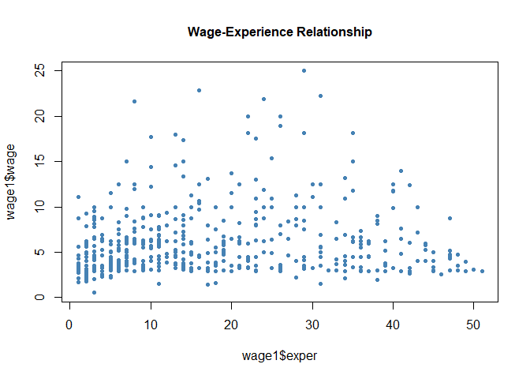
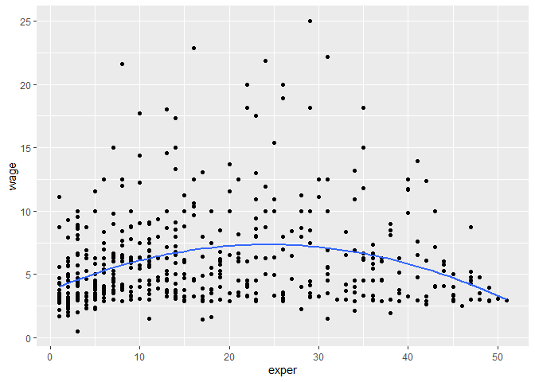
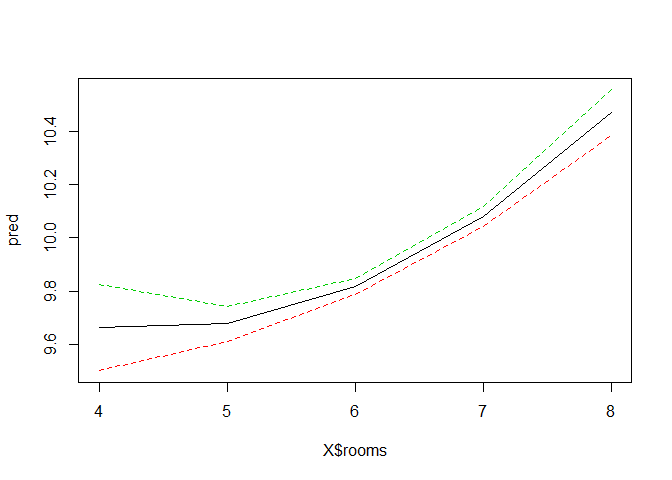
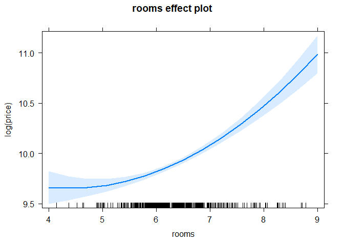

<style type="text/css"> 
body{
  font-size: 12pt;
}
code.r{
  font-size: 12pt;
}
</style>


# Changing the Units of Measurement (Data Scaling)

When we re-scale our data, OLS coefficient estimates and their standard errors change. But t-statistics, F statistics, and $R^2$ remain the same. In other words, the explanatory power of the model does not change. 

As an example, we will replicate the birthweight model that we discussed in class. 
The model results with the original units of measurements: 

```r
library(wooldridge)
# estimate the original model
# bwght is measured in ounces 
model1 <- lm(bwght ~ cigs + faminc, data=bwght)
summary(model1)
```

```
## 
## Call:
## lm(formula = bwght ~ cigs + faminc, data = bwght)
## 
## Residuals:
##     Min      1Q  Median      3Q     Max 
## -96.061 -11.543   0.638  13.126 150.083 
## 
## Coefficients:
##              Estimate Std. Error t value Pr(>|t|)    
## (Intercept) 116.97413    1.04898 111.512  < 2e-16 ***
## cigs         -0.46341    0.09158  -5.060 4.75e-07 ***
## faminc        0.09276    0.02919   3.178  0.00151 ** 
## ---
## Signif. codes:  0 '***' 0.001 '**' 0.01 '*' 0.05 '.' 0.1 ' ' 1
## 
## Residual standard error: 20.06 on 1385 degrees of freedom
## Multiple R-squared:  0.0298,	Adjusted R-squared:  0.0284 
## F-statistic: 21.27 on 2 and 1385 DF,  p-value: 7.942e-10
```

Now change birth weight from ounces to grams and re-estimate the model: 

```r
# 1 ounce = 28.3495231 grams 
bwght$bwghtgrams <- bwght$bwght*28.3495231
# regression with bwght in grams 
model2 <- lm(bwghtgrams ~ cigs + faminc, data=bwght)
summary(model2)
```

```
## 
## Call:
## lm(formula = bwghtgrams ~ cigs + faminc, data = bwght)
## 
## Residuals:
##     Min      1Q  Median      3Q     Max 
## -2723.3  -327.2    18.1   372.1  4254.8 
## 
## Coefficients:
##              Estimate Std. Error t value Pr(>|t|)    
## (Intercept) 3316.1608    29.7382 111.512  < 2e-16 ***
## cigs         -13.1374     2.5962  -5.060 4.75e-07 ***
## faminc         2.6298     0.8275   3.178  0.00151 ** 
## ---
## Signif. codes:  0 '***' 0.001 '**' 0.01 '*' 0.05 '.' 0.1 ' ' 1
## 
## Residual standard error: 568.8 on 1385 degrees of freedom
## Multiple R-squared:  0.0298,	Adjusted R-squared:  0.0284 
## F-statistic: 21.27 on 2 and 1385 DF,  p-value: 7.942e-10
```

Compare the output. Do fitted values and residuals also change? check your ansswer.  

Now let us change the family income from 1000 Dollars to Dollars. 

```r
# change faminc to dollars instead of 1000$ 
bwght$famincdollars <- bwght$faminc*1000
model3 <- lm(bwghtgrams ~ cigs + famincdollars, data=bwght)
summary(model3)
```

```
## 
## Call:
## lm(formula = bwghtgrams ~ cigs + famincdollars, data = bwght)
## 
## Residuals:
##     Min      1Q  Median      3Q     Max 
## -2723.3  -327.2    18.1   372.1  4254.8 
## 
## Coefficients:
##                 Estimate Std. Error t value Pr(>|t|)    
## (Intercept)    3.316e+03  2.974e+01 111.512  < 2e-16 ***
## cigs          -1.314e+01  2.596e+00  -5.060 4.75e-07 ***
## famincdollars  2.630e-03  8.275e-04   3.178  0.00151 ** 
## ---
## Signif. codes:  0 '***' 0.001 '**' 0.01 '*' 0.05 '.' 0.1 ' ' 1
## 
## Residual standard error: 568.8 on 1385 degrees of freedom
## Multiple R-squared:  0.0298,	Adjusted R-squared:  0.0284 
## F-statistic: 21.27 on 2 and 1385 DF,  p-value: 7.942e-10
```

Interpret the coefficient estimates. 

Note: you can directly rescale your variables in R: 

```r
# directly changing units
summary( lm(I(bwght*28.3495231) ~ cigs + I(faminc*1000), data=bwght) )
```

```
## 
## Call:
## lm(formula = I(bwght * 28.3495231) ~ cigs + I(faminc * 1000), 
##     data = bwght)
## 
## Residuals:
##     Min      1Q  Median      3Q     Max 
## -2723.3  -327.2    18.1   372.1  4254.8 
## 
## Coefficients:
##                    Estimate Std. Error t value Pr(>|t|)    
## (Intercept)       3.316e+03  2.974e+01 111.512  < 2e-16 ***
## cigs             -1.314e+01  2.596e+00  -5.060 4.75e-07 ***
## I(faminc * 1000)  2.630e-03  8.275e-04   3.178  0.00151 ** 
## ---
## Signif. codes:  0 '***' 0.001 '**' 0.01 '*' 0.05 '.' 0.1 ' ' 1
## 
## Residual standard error: 568.8 on 1385 degrees of freedom
## Multiple R-squared:  0.0298,	Adjusted R-squared:  0.0284 
## F-statistic: 21.27 on 2 and 1385 DF,  p-value: 7.942e-10
```

Let's see what happens if we change the number of cigarettes smoked per day to the pack of cigarettes: 

```r
# change cigs to packs 
bwght$packs <- bwght$cigs/20
model4 <- lm(bwghtgrams ~ packs + famincdollars, data=bwght)
summary(model4, digits = 5)
```

```
## 
## Call:
## lm(formula = bwghtgrams ~ packs + famincdollars, data = bwght)
## 
## Residuals:
##     Min      1Q  Median      3Q     Max 
## -2723.3  -327.2    18.1   372.1  4254.8 
## 
## Coefficients:
##                 Estimate Std. Error t value Pr(>|t|)    
## (Intercept)    3.316e+03  2.974e+01 111.512  < 2e-16 ***
## packs         -2.627e+02  5.192e+01  -5.060 4.75e-07 ***
## famincdollars  2.630e-03  8.275e-04   3.178  0.00151 ** 
## ---
## Signif. codes:  0 '***' 0.001 '**' 0.01 '*' 0.05 '.' 0.1 ' ' 1
## 
## Residual standard error: 568.8 on 1385 degrees of freedom
## Multiple R-squared:  0.0298,	Adjusted R-squared:  0.0284 
## F-statistic: 21.27 on 2 and 1385 DF,  p-value: 7.942e-10
```

Interpret the coefficient estimates. Compare them to the original units of measurements. Which one is easier to interpret and understand? 

# Standardized Regression Example: Air pollution and house prices 

In this model, we are interested in understanding the impact of air pollution on house values. In addition to air pollution (nox) we have a set of variables on neighborhood characteristics that may be important for house prices. 

We estimate the model in standardized form. In R we can do that as follows: 

```r
# Estimate model with standardized variables:
lm(scale(price) ~ 0+scale(nox)+scale(crime)+scale(rooms)+
                              scale(dist)+scale(stratio), data=hprice2)
```

```
## 
## Call:
## lm(formula = scale(price) ~ 0 + scale(nox) + scale(crime) + scale(rooms) + 
##     scale(dist) + scale(stratio), data = hprice2)
## 
## Coefficients:
##     scale(nox)    scale(crime)    scale(rooms)     scale(dist)  scale(stratio)  
##        -0.3404         -0.1433          0.5139         -0.2348         -0.2703
```

Original units of measurements: 


```r
res1 <- lm(price ~ nox + crime + rooms + dist + stratio, data=hprice2)
summary(res1)
```

```
## 
## Call:
## lm(formula = price ~ nox + crime + rooms + dist + stratio, data = hprice2)
## 
## Residuals:
##    Min     1Q Median     3Q    Max 
## -13914  -3201   -662   2110  38064 
## 
## Coefficients:
##             Estimate Std. Error t value Pr(>|t|)    
## (Intercept) 20871.13    5054.60   4.129 4.27e-05 ***
## nox         -2706.43     354.09  -7.643 1.09e-13 ***
## crime        -153.60      32.93  -4.665 3.97e-06 ***
## rooms        6735.50     393.60  17.112  < 2e-16 ***
## dist        -1026.81     188.11  -5.459 7.57e-08 ***
## stratio     -1149.20     127.43  -9.018  < 2e-16 ***
## ---
## Signif. codes:  0 '***' 0.001 '**' 0.01 '*' 0.05 '.' 0.1 ' ' 1
## 
## Residual standard error: 5586 on 500 degrees of freedom
## Multiple R-squared:  0.6357,	Adjusted R-squared:  0.632 
## F-statistic: 174.5 on 5 and 500 DF,  p-value: < 2.2e-16
```

# Logarithmic Forms: Example 

Consider a partially logarithmic house price model: 


```r
# Estimate model with logs:
lm(log(price)~log(nox)+rooms, data=hprice2)
```

```
## 
## Call:
## lm(formula = log(price) ~ log(nox) + rooms, data = hprice2)
## 
## Coefficients:
## (Intercept)     log(nox)        rooms  
##      9.2337      -0.7177       0.3059
```

In class we saw that the actual effect of an additional room is not 30.6% but 
$$
\widehat{\% \Delta y}=100 \times[\exp (0.306)-1]= 35.8\%
$$

# Quadratic Terms

## Example: House prices

```r
resquad <- lm(log(price)~log(nox)+log(dist)+rooms+I(rooms^2)+
           stratio,data=hprice2)
summary(resquad)
```

```
## 
## Call:
## lm(formula = log(price) ~ log(nox) + log(dist) + rooms + I(rooms^2) + 
##     stratio, data = hprice2)
## 
## Residuals:
##      Min       1Q   Median       3Q      Max 
## -1.04285 -0.12774  0.02038  0.12650  1.25272 
## 
## Coefficients:
##              Estimate Std. Error t value Pr(>|t|)    
## (Intercept) 13.385477   0.566473  23.630  < 2e-16 ***
## log(nox)    -0.901682   0.114687  -7.862 2.34e-14 ***
## log(dist)   -0.086781   0.043281  -2.005  0.04549 *  
## rooms       -0.545113   0.165454  -3.295  0.00106 ** 
## I(rooms^2)   0.062261   0.012805   4.862 1.56e-06 ***
## stratio     -0.047590   0.005854  -8.129 3.42e-15 ***
## ---
## Signif. codes:  0 '***' 0.001 '**' 0.01 '*' 0.05 '.' 0.1 ' ' 1
## 
## Residual standard error: 0.2592 on 500 degrees of freedom
## Multiple R-squared:  0.6028,	Adjusted R-squared:  0.5988 
## F-statistic: 151.8 on 5 and 500 DF,  p-value: < 2.2e-16
```
Exercise: What is the turning point? 

## Example: Wage Equation 

```r
# scatter plot
plot(wage1$exper, wage1$wage,
     col = "steelblue",
     pch = 20,
     main = "Wage-Experience Relationship", 
     cex.main = 1)
# scatter plot with quadratic fit
# requires ggplot2
library(ggplot2)
```

```
## Warning: package 'ggplot2' was built under R version 3.6.3
```

<!-- -->

```r
ggplot(wage1, aes(x=exper, y=wage)) + geom_point()+stat_smooth(se=F,method='lm', formula=y~poly(x,2))
```

<!-- -->

```r
# OLS fit
reswage <- lm(log(wage)~educ+exper+I(exper^2),data=wage1)
summary(reswage)
```

```
## 
## Call:
## lm(formula = log(wage) ~ educ + exper + I(exper^2), data = wage1)
## 
## Residuals:
##      Min       1Q   Median       3Q      Max 
## -1.96387 -0.29375 -0.04009  0.29497  1.30216 
## 
## Coefficients:
##               Estimate Std. Error t value Pr(>|t|)    
## (Intercept)  0.1279975  0.1059323   1.208    0.227    
## educ         0.0903658  0.0074680  12.100  < 2e-16 ***
## exper        0.0410089  0.0051965   7.892 1.77e-14 ***
## I(exper^2)  -0.0007136  0.0001158  -6.164 1.42e-09 ***
## ---
## Signif. codes:  0 '***' 0.001 '**' 0.01 '*' 0.05 '.' 0.1 ' ' 1
## 
## Residual standard error: 0.4459 on 522 degrees of freedom
## Multiple R-squared:  0.3003,	Adjusted R-squared:  0.2963 
## F-statistic: 74.67 on 3 and 522 DF,  p-value: < 2.2e-16
```

Exercise: What is the turning point?

# Models with Interaction Terms 

## Example: Effects of attendance on final exam performance 

```r
# Estimate model with interaction effect:
(myres<-lm(stndfnl~atndrte*priGPA+ACT+I(priGPA^2)+I(ACT^2), data=attend))
```

```
## 
## Call:
## lm(formula = stndfnl ~ atndrte * priGPA + ACT + I(priGPA^2) + 
##     I(ACT^2), data = attend)
## 
## Coefficients:
##    (Intercept)         atndrte          priGPA             ACT     I(priGPA^2)  
##       2.050293       -0.006713       -1.628540       -0.128039        0.295905  
##       I(ACT^2)  atndrte:priGPA  
##       0.004533        0.005586
```


```r
# Estimate for partial effect at priGPA=2.59:
b <- coef(myres)
b["atndrte"] + 2.59*b["atndrte:priGPA"] 
```

```
##     atndrte 
## 0.007754572
```


```r
# Test partial effect for priGPA=2.59:
library(car)
```

```
## Loading required package: carData
```

```r
linearHypothesis(myres,c("atndrte+2.59*atndrte:priGPA"))
```

```
## Linear hypothesis test
## 
## Hypothesis:
## atndrte  + 2.59 atndrte:priGPA = 0
## 
## Model 1: restricted model
## Model 2: stndfnl ~ atndrte * priGPA + ACT + I(priGPA^2) + I(ACT^2)
## 
##   Res.Df    RSS Df Sum of Sq      F   Pr(>F)   
## 1    674 519.34                                
## 2    673 512.76  1    6.5772 8.6326 0.003415 **
## ---
## Signif. codes:  0 '***' 0.001 '**' 0.01 '*' 0.05 '.' 0.1 ' ' 1
```

# Prediction 
When we plug the regressor values into the estimated model we get fitted values. Now, we generalize this to arbitrary values in order to predict the value of the dependent variable given certain values of the regressors.

## Point Prediction 
__predict__ command produces the predicted value of the dependent variable given by the specific regressor values. It also calculates the standard error and confidence intervals of the predicted value. Consider the following example.


```r
data(gpa2, package='wooldridge')

# Regress and report coefficients
reg <- lm(colgpa~sat+hsperc+hsize+I(hsize^2),data=gpa2)
summary(reg)

# Generate data set containing the regressor values for predictions
cvalues <- data.frame(sat=1200, hsperc=30, hsize=5)

# Point estimate of prediction
predict(reg, cvalues)

# Point estimate and 95% confidence interval
predict(reg, cvalues, interval = "confidence")

# Define three sets of regressor variables
cvalues <- data.frame(sat=c(1200,900,1400), hsperc=c(30,20,5), hsize=c(5,3,1))
cvalues
# Point estimates and 99% confidence intervals for these
predict(reg, cvalues, interval = "confidence", level=0.99)
```

```
## 
## Call:
## lm(formula = colgpa ~ sat + hsperc + hsize + I(hsize^2), data = gpa2)
## 
## Residuals:
##      Min       1Q   Median       3Q      Max 
## -2.57543 -0.35081  0.03342  0.39945  1.81683 
## 
## Coefficients:
##               Estimate Std. Error t value Pr(>|t|)    
## (Intercept)  1.493e+00  7.534e-02  19.812  < 2e-16 ***
## sat          1.492e-03  6.521e-05  22.886  < 2e-16 ***
## hsperc      -1.386e-02  5.610e-04 -24.698  < 2e-16 ***
## hsize       -6.088e-02  1.650e-02  -3.690 0.000228 ***
## I(hsize^2)   5.460e-03  2.270e-03   2.406 0.016191 *  
## ---
## Signif. codes:  0 '***' 0.001 '**' 0.01 '*' 0.05 '.' 0.1 ' ' 1
## 
## Residual standard error: 0.5599 on 4132 degrees of freedom
## Multiple R-squared:  0.2781,	Adjusted R-squared:  0.2774 
## F-statistic:   398 on 4 and 4132 DF,  p-value: < 2.2e-16
## 
##        1 
## 2.700075 
##        fit      lwr      upr
## 1 2.700075 2.661104 2.739047
##    sat hsperc hsize
## 1 1200     30     5
## 2  900     20     3
## 3 1400      5     1
##        fit      lwr      upr
## 1 2.700075 2.648850 2.751301
## 2 2.425282 2.388540 2.462025
## 3 3.457448 3.385572 3.529325
```

## Interval Prediction 
Confidence intervals reflect the uncertainty about the _expected value_ of the dependent variable. If we want to predict the college GPA of an individual, we have to account for the additional uncertainty reflected by the error term _u_. __predict__ command computes the prediction intervals with the option __interval="prediction"__ instead of __interval="confidence"__.

```r
data(gpa2, package='wooldridge')

# Regress (as before)
reg <- lm(colgpa~sat+hsperc+hsize+I(hsize^2),data=gpa2)

# Define three sets of regressor variables (as before)
cvalues <- data.frame(sat=c(1200,900,1400), hsperc=c(30,20,5), hsize=c(5,3,1))

# Point estimates and 95% prediction intervals for these
predict(reg, cvalues, interval = "prediction")
```

```
##        fit      lwr      upr
## 1 2.700075 1.601749 3.798402
## 2 2.425282 1.327292 3.523273
## 3 3.457448 2.358452 4.556444
```

# Effect Plots for Nonlinear Specifications 
In models with nonlinear terms, we need to do additional computations to get partial effects at different regressor values since the coefficients are difficult to insterpret directly. For a better understanding, we calculate different values of one regressor while keeping the others fixed.
Consider the __house price__ example. We may visualize the effect of _rooms_ while other variables fixed to sample means. 

Manual effects plot:

```r
# Repeating the regression from Example 6.2:
data(hprice2, package='wooldridge')

res <- lm( log(price) ~ log(nox)+log(dist)+rooms+I(rooms^2)+stratio, data=hprice2)

# Predictions: Values of the regressors:
# rooms = 4-8, all others at the sample mean:
X <- data.frame(rooms=seq(4,8),nox=5.5498,dist=3.7958,stratio=18.4593)

# Calculate predictions and confidence interval:
pred <- predict(res, X, interval = "confidence")

# Table of regressor values, predictions and CI:
cbind(X,pred)

# Plot 
matplot(X$rooms, pred, type="l", lty=c(1,2,2))
```

<!-- -->

```
##   rooms    nox   dist stratio       fit       lwr       upr
## 1     4 5.5498 3.7958 18.4593  9.661698  9.499807  9.823589
## 2     5 5.5498 3.7958 18.4593  9.676936  9.610210  9.743661
## 3     6 5.5498 3.7958 18.4593  9.816696  9.787050  9.846341
## 4     7 5.5498 3.7958 18.4593 10.080978 10.042404 10.119553
## 5     8 5.5498 3.7958 18.4593 10.469783 10.383355 10.556211
```

Automatic effects plot:

```r
# Repeating the regression from Example 6.2:
data(hprice2, package='wooldridge')

res <- lm( log(price) ~ log(nox)+log(dist)+rooms+I(rooms^2)+stratio, data=hprice2)

# Automatic effects plot using the package "effects"
#install.packages('effects')
library(effects)
```

```
## Warning: package 'effects' was built under R version 3.6.3
```

```
## Registered S3 methods overwritten by 'lme4':
##   method                          from
##   cooks.distance.influence.merMod car 
##   influence.merMod                car 
##   dfbeta.influence.merMod         car 
##   dfbetas.influence.merMod        car
```

```
## lattice theme set by effectsTheme()
## See ?effectsTheme for details.
```

```r
plot( effect("rooms",res) )
```

<!-- -->


<div class="tocify-extend-page" data-unique="tocify-extend-page" style="height: 0;"></div>


