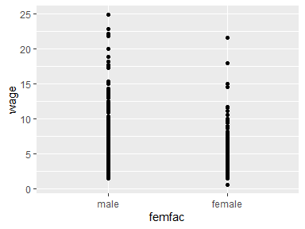
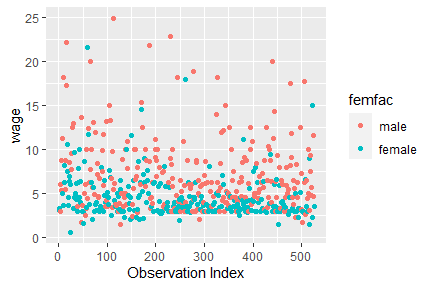
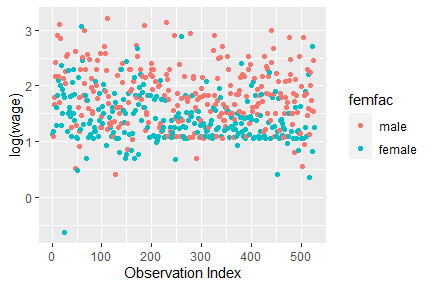
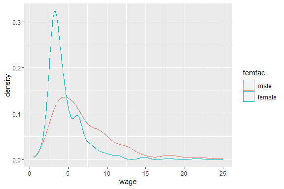
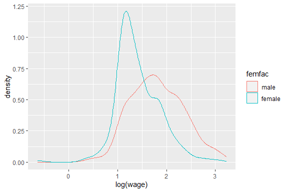
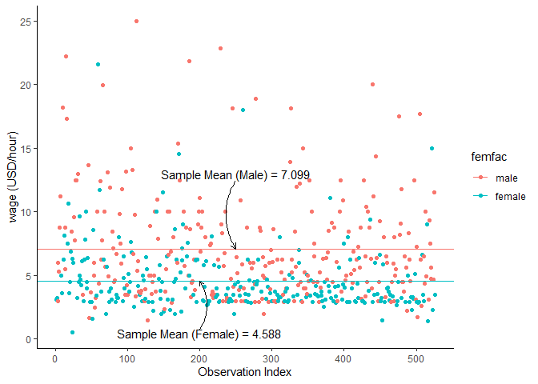
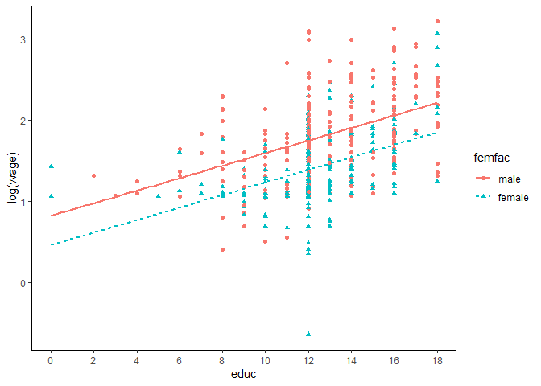

<style type="text/css"> 
body{
  font-size: 12pt;
}
code.r{
  font-size: 12pt;
}
</style>


# Qualitative Explanatory Variables 

There are several types of qualitative variables, for example, binary variables, ordinal variables, count variables, etc. In class we saw how to incorporate qualitative information in the form of binary (or dummy) variables. 
 
Dummy variables are just binary variables that take value 1 for one group and 0 for the other. In R, factor variables are simply categorical variables defined in a specific way. They can easily be defined from an existing binary variables using:  

```r
library(wooldridge)
data(wage1)
femfac <- factor(wage1$female, labels = c("male","female"))
summary(femfac)
```

```
##   male female 
##    274    252
```

Let us visualize wages of men and women in the data: 

```r
# wages over female dummy
library(ggplot2)
```

```
## Warning: package 'ggplot2' was built under R version 3.6.3
```

```r
ggplot(wage1, aes(femfac, wage))+geom_point() 
```

<!-- -->


Another way to visualize this is to draw scatter plot over observations: 

```r
# scatter plot over observation index 
ggplot(wage1, aes(as.numeric(rownames(wage1)), wage)) +
  geom_point(aes(color = femfac)) + 
  labs(x = "Observation Index") 
```

<!-- -->

Log wages: 

```r
# scatter plot of log wages over observation index 
ggplot(wage1, aes(as.numeric(rownames(wage1)), log(wage))) +
  geom_point(aes(color = femfac)) + 
  labs(x = "Observation Index")  
```

<!-- -->


Wage densities over gender: 

```r
# wage density over female dummy
ggplot(wage1, aes(wage, colour = femfac)) + geom_density()  
```

<!-- -->

```r
# compare to the logarithmic wages: 
ggplot(wage1, aes(log(wage), colour = femfac)) + geom_density()   
```

<!-- -->


# Regression with a single dummy variable

Here is the regression of wage on female dummy without any continuous X variables: 

```r
(lm(wage ~ female, data=wage1))
```

```
## 
## Call:
## lm(formula = wage ~ female, data = wage1)
## 
## Coefficients:
## (Intercept)       female  
##       7.099       -2.512
```

As we learned in class, when there are no X variables in the regression, the intercept will be sample average of the base group. Because female=1 for female workers, the base group (female=0) is men. So, the average wage in the sample is 7.099 for men. The coefficient on female is negative indicating that women earn about 2.512 USD less than men on average. The following graph depicts this:

```
## Warning: package 'plyr' was built under R version 3.6.3
```

<!-- -->


# Regression with a single dummy variable and continuous X

Here is the logarithmic wage regression with female dummy and education levels: 

```r
(lm(log(wage) ~ female + educ, data=wage1))
```

```
## 
## Call:
## lm(formula = log(wage) ~ female + educ, data = wage1)
## 
## Coefficients:
## (Intercept)       female         educ  
##      0.8263      -0.3609       0.0772
```

Now, we can compare two workers of opposite genders at the same level of education. 
Given that education level is fixed, women earn almost 36.09% less than men. The return to an extra year of education is 7.7% for both men and women. 


We can visualize this regression as follows: 


```
## `geom_smooth()` using formula 'y ~ x'
```

<!-- -->


**Exercise**: locate the intercept of the base group. What is the intercept for the women?

We can add more continuous X variables in our regression model. Now the coefficient on the dummy variable will be interpreted conditional on those X variables (ceteris paribus). For example, consider the wage regression: 

```r
(lm(log(wage) ~ female + educ + exper + tenure, data=wage1))
```

```
## 
## Call:
## lm(formula = log(wage) ~ female + educ + exper + tenure, data = wage1)
## 
## Coefficients:
## (Intercept)       female         educ        exper       tenure  
##    0.501348    -0.301146     0.087462     0.004629     0.017367
```

**Exercise**: Interpret the coefficient on the female dummy. 


# Multiple dummy variables

**Example**: Wage regression with only female and married dummies: 

```r
summary(lm(log(wage) ~ female + married, data=wage1))
```

```
## 
## Call:
## lm(formula = log(wage) ~ female + married, data = wage1)
## 
## Residuals:
##      Min       1Q   Median       3Q      Max 
## -1.92899 -0.33309 -0.07353  0.30510  1.77997 
## 
## Coefficients:
##             Estimate Std. Error t value Pr(>|t|)    
## (Intercept)  1.65345    0.04169  39.663  < 2e-16 ***
## female      -0.35934    0.04257  -8.441 3.10e-16 ***
## married      0.23337    0.04357   5.356 1.27e-07 ***
## ---
## Signif. codes:  0 '***' 0.001 '**' 0.01 '*' 0.05 '.' 0.1 ' ' 1
## 
## Residual standard error: 0.481 on 523 degrees of freedom
## Multiple R-squared:  0.1844,	Adjusted R-squared:  0.1813 
## F-statistic: 59.11 on 2 and 523 DF,  p-value: < 2.2e-16
```

**Exercise**: Interpret the coefficients on female and married dummies. What is the base group?

**Example**: Dummy variables with multiple categories 

```r
# create new dummies from female and married 
wage1$marrmale <- wage1$married*(1-wage1$female)
wage1$marrfem <- wage1$married*wage1$female
wage1$singfem <- (1-wage1$married)*wage1$female
wage1$singmale <- (1-wage1$married)*(1-wage1$female)
summary(lm(log(wage) ~ marrmale+marrfem+singfem+educ+exper+I(exper^2)+
      tenure+I(tenure^2), data=wage1))
```

```
## 
## Call:
## lm(formula = log(wage) ~ marrmale + marrfem + singfem + educ + 
##     exper + I(exper^2) + tenure + I(tenure^2), data = wage1)
## 
## Residuals:
##      Min       1Q   Median       3Q      Max 
## -1.89697 -0.24060 -0.02689  0.23144  1.09197 
## 
## Coefficients:
##               Estimate Std. Error t value Pr(>|t|)    
## (Intercept)  0.3213781  0.1000090   3.213 0.001393 ** 
## marrmale     0.2126757  0.0553572   3.842 0.000137 ***
## marrfem     -0.1982676  0.0578355  -3.428 0.000656 ***
## singfem     -0.1103502  0.0557421  -1.980 0.048272 *  
## educ         0.0789103  0.0066945  11.787  < 2e-16 ***
## exper        0.0268006  0.0052428   5.112 4.50e-07 ***
## I(exper^2)  -0.0005352  0.0001104  -4.847 1.66e-06 ***
## tenure       0.0290875  0.0067620   4.302 2.03e-05 ***
## I(tenure^2) -0.0005331  0.0002312  -2.306 0.021531 *  
## ---
## Signif. codes:  0 '***' 0.001 '**' 0.01 '*' 0.05 '.' 0.1 ' ' 1
## 
## Residual standard error: 0.3933 on 517 degrees of freedom
## Multiple R-squared:  0.4609,	Adjusted R-squared:  0.4525 
## F-statistic: 55.25 on 8 and 517 DF,  p-value: < 2.2e-16
```


**Exercise**: Write the model in equation form and interpret the coefficients. 

# Allowing for Different Slopes 


```r
# create interactions manually 
wage1$femeduc <- wage1$female*wage1$educ
summary(lm(log(wage) ~ female+educ+femeduc+exper+I(exper^2)+
      tenure+I(tenure^2), data=wage1))
```

```
## 
## Call:
## lm(formula = log(wage) ~ female + educ + femeduc + exper + I(exper^2) + 
##     tenure + I(tenure^2), data = wage1)
## 
## Residuals:
##      Min       1Q   Median       3Q      Max 
## -1.83265 -0.25261 -0.02374  0.25396  1.13584 
## 
## Coefficients:
##               Estimate Std. Error t value Pr(>|t|)    
## (Intercept)  0.3888060  0.1186871   3.276  0.00112 ** 
## female      -0.2267886  0.1675394  -1.354  0.17644    
## educ         0.0823692  0.0084699   9.725  < 2e-16 ***
## femeduc     -0.0055645  0.0130618  -0.426  0.67028    
## exper        0.0293366  0.0049842   5.886 7.11e-09 ***
## I(exper^2)  -0.0005804  0.0001075  -5.398 1.03e-07 ***
## tenure       0.0318967  0.0068640   4.647 4.28e-06 ***
## I(tenure^2) -0.0005900  0.0002352  -2.509  0.01242 *  
## ---
## Signif. codes:  0 '***' 0.001 '**' 0.01 '*' 0.05 '.' 0.1 ' ' 1
## 
## Residual standard error: 0.4001 on 518 degrees of freedom
## Multiple R-squared:  0.441,	Adjusted R-squared:  0.4334 
## F-statistic: 58.37 on 7 and 518 DF,  p-value: < 2.2e-16
```

Using built-in R function 

```r
# use R function to add interactions 
summary(lm(log(wage) ~ female+educ+I(female*educ)+exper+I(exper^2)+
      tenure+I(tenure^2), data=wage1))
```

```
## 
## Call:
## lm(formula = log(wage) ~ female + educ + I(female * educ) + exper + 
##     I(exper^2) + tenure + I(tenure^2), data = wage1)
## 
## Residuals:
##      Min       1Q   Median       3Q      Max 
## -1.83265 -0.25261 -0.02374  0.25396  1.13584 
## 
## Coefficients:
##                    Estimate Std. Error t value Pr(>|t|)    
## (Intercept)       0.3888060  0.1186871   3.276  0.00112 ** 
## female           -0.2267886  0.1675394  -1.354  0.17644    
## educ              0.0823692  0.0084699   9.725  < 2e-16 ***
## I(female * educ) -0.0055645  0.0130618  -0.426  0.67028    
## exper             0.0293366  0.0049842   5.886 7.11e-09 ***
## I(exper^2)       -0.0005804  0.0001075  -5.398 1.03e-07 ***
## tenure            0.0318967  0.0068640   4.647 4.28e-06 ***
## I(tenure^2)      -0.0005900  0.0002352  -2.509  0.01242 *  
## ---
## Signif. codes:  0 '***' 0.001 '**' 0.01 '*' 0.05 '.' 0.1 ' ' 1
## 
## Residual standard error: 0.4001 on 518 degrees of freedom
## Multiple R-squared:  0.441,	Adjusted R-squared:  0.4334 
## F-statistic: 58.37 on 7 and 518 DF,  p-value: < 2.2e-16
```

Interaction at the sample mean of education: 

```r
# Interaction with education in deviation from sample average 
summary(lm(log(wage) ~ female + I(educ-12.5) + I(female*(educ-12.5)) +
             exper+I(exper^2) + tenure+I(tenure^2), data=wage1))
```

```
## 
## Call:
## lm(formula = log(wage) ~ female + I(educ - 12.5) + I(female * 
##     (educ - 12.5)) + exper + I(exper^2) + tenure + I(tenure^2), 
##     data = wage1)
## 
## Residuals:
##      Min       1Q   Median       3Q      Max 
## -1.83265 -0.25261 -0.02374  0.25396  1.13584 
## 
## Coefficients:
##                             Estimate Std. Error t value Pr(>|t|)    
## (Intercept)                1.4184208  0.0440456  32.203  < 2e-16 ***
## female                    -0.2963450  0.0358358  -8.270 1.14e-15 ***
## I(educ - 12.5)             0.0823692  0.0084699   9.725  < 2e-16 ***
## I(female * (educ - 12.5)) -0.0055645  0.0130618  -0.426   0.6703    
## exper                      0.0293366  0.0049842   5.886 7.11e-09 ***
## I(exper^2)                -0.0005804  0.0001075  -5.398 1.03e-07 ***
## tenure                     0.0318967  0.0068640   4.647 4.28e-06 ***
## I(tenure^2)               -0.0005900  0.0002352  -2.509   0.0124 *  
## ---
## Signif. codes:  0 '***' 0.001 '**' 0.01 '*' 0.05 '.' 0.1 ' ' 1
## 
## Residual standard error: 0.4001 on 518 degrees of freedom
## Multiple R-squared:  0.441,	Adjusted R-squared:  0.4334 
## F-statistic: 58.37 on 7 and 518 DF,  p-value: < 2.2e-16
```

**Exercise**: Interpret the coefficient on female. Is it statistically significant? 
Test the joint significance of the coefficients on female and the interaction term. 


<div class="tocify-extend-page" data-unique="tocify-extend-page" style="height: 0;"></div>


