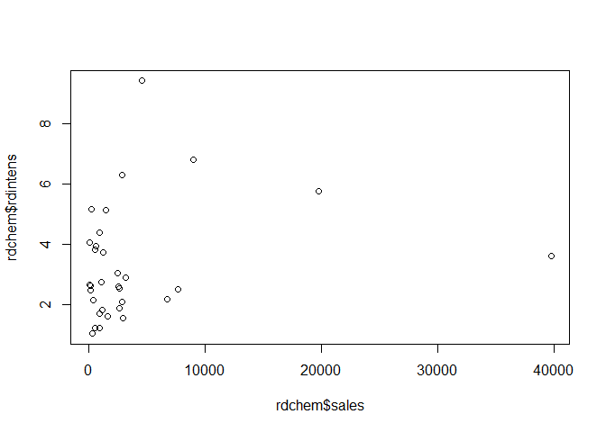
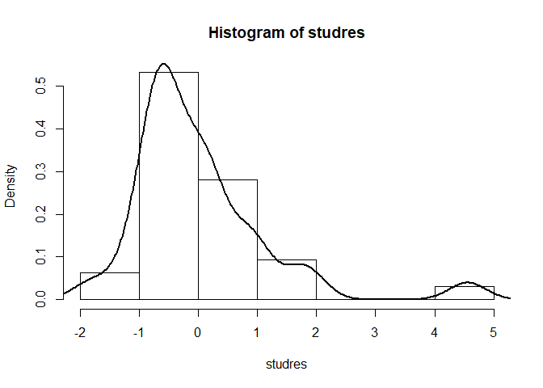
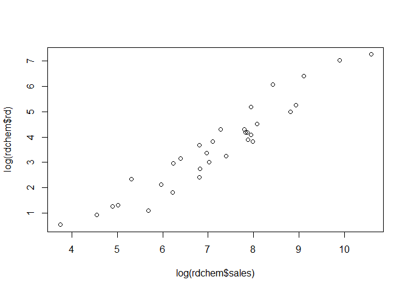
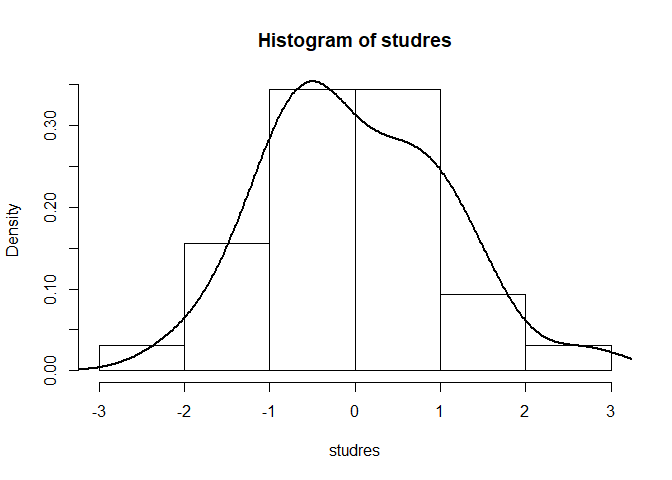

<style type="text/css"> 
body{
  font-size: 12pt;
}
code.r{
  font-size: 12pt;
}
</style>


# Functional Form Misspecification  
 
We can use Ramsey's RESET test to detect functional form misspecification. 

## RESET Test Example:  Housing Price Model

Automatic computation of RESET test using `lmtest` package: 


```r
library(wooldridge)
# don't forget to install lmtest before you load them
library(lmtest)  
```

```
## Loading required package: zoo
```

```
## 
## Attaching package: 'zoo'
```

```
## The following objects are masked from 'package:base':
## 
##     as.Date, as.Date.numeric
```

```r
# original linear regression
orig <- lm(price ~ lotsize + sqrft + bdrms, data = hprice1)

# RESET test
library(lmtest)
resettest(orig)
```

```
## 
## 	RESET test
## 
## data:  orig
## RESET = 4.6682, df1 = 2, df2 = 82, p-value = 0.01202
```


Manual computation of RESET test: 


```r
# original linear regression
orig <- lm(price ~ lotsize + sqrft + bdrms, data = hprice1)

# regression for RESET test
RESETreg <- lm(price ~ lotsize + sqrft + bdrms + 
                 I(fitted(orig)^2) + I(fitted(orig)^3), data=hprice1)
# note that we added powers of fitted values
RESETreg

# RESET test. H0: all coeffs including "fitted" are=0 
library(car)
```

```
## Loading required package: carData
```

```r
linearHypothesis(RESETreg, matchCoefs(RESETreg,"fitted"))
```

```
## 
## Call:
## lm(formula = price ~ lotsize + sqrft + bdrms + I(fitted(orig)^2) + 
##     I(fitted(orig)^3), data = hprice1)
## 
## Coefficients:
##       (Intercept)            lotsize              sqrft              bdrms  
##         1.661e+02          1.537e-04          1.760e-02          2.175e+00  
## I(fitted(orig)^2)  I(fitted(orig)^3)  
##         3.534e-04          1.546e-06  
## 
## Linear hypothesis test
## 
## Hypothesis:
## I(fitted(orig)^2) = 0
## I(fitted(orig)^3) = 0
## 
## Model 1: restricted model
## Model 2: price ~ lotsize + sqrft + bdrms + I(fitted(orig)^2) + I(fitted(orig)^3)
## 
##   Res.Df    RSS Df Sum of Sq      F  Pr(>F)  
## 1     84 300724                              
## 2     82 269984  2     30740 4.6682 0.01202 *
## ---
## Signif. codes:  0 '***' 0.001 '**' 0.01 '*' 0.05 '.' 0.1 ' ' 1
```


RESET F statistic is 4.67 with p-value=0.01. Thus, the null of no functional form misspecification is rejected at 5% level. 

Use logarithmic functional form: 


```r
logreg <- lm(log(price) ~ log(lotsize) + log(sqrft) + bdrms, data = hprice1)

# RESET test
library(lmtest)
resettest(logreg)
```

```
## 
## 	RESET test
## 
## data:  logreg
## RESET = 2.565, df1 = 2, df2 = 82, p-value = 0.08308
```

Interpret the RESET test result. Use 5% statistical significance level. 

# Non-nested tests 

Consider two house price models, model1 and model2, which are non-nested alternatives. 
The model that includes both model1 and model2 as special cases (i.e., nested) is called the **encompassing** model. 


```r
# two alternative models
model1 <- lm(price ~     lotsize  +     sqrft  + bdrms, data = hprice1)
model2 <- lm(price ~ log(lotsize) + log(sqrft) + bdrms, data = hprice1)

# Test against comprehensive model
library(lmtest)
encomptest(model1, model2, data = hprice1)
```

```
## Encompassing test
## 
## Model 1: price ~ lotsize + sqrft + bdrms
## Model 2: price ~ log(lotsize) + log(sqrft) + bdrms
## Model E: price ~ lotsize + sqrft + bdrms + log(lotsize) + log(sqrft)
##           Res.Df Df      F    Pr(>F)    
## M1 vs. ME     82 -2 7.8613 0.0007526 ***
## M2 vs. ME     82 -2 7.0508 0.0014943 ** 
## ---
## Signif. codes:  0 '***' 0.001 '**' 0.01 '*' 0.05 '.' 0.1 ' ' 1
```

According to the encompassing test both models are rejected against the encompassing model. (note that the dependent variable must be the same in all models).

# Missing Data 
In many data sets, the existence of missing observations is usual. In R, missing data can be represented by different values.
__NA__ (not available) refers to no information.
__NaN__ (not a number) indicates that the value is not defined.
The function __is.na()__ returns _TRUE_ if the observation is either __NA__ or __NaN__ and _FALSE_ otherwise. 

Operaitons resulting in $\pm\infty$ like $log(0)$ or $1/0$ are not coded as __NaN__ but as __Inf__ or __-Inf__. R can do calculations with these numbers.


```r
x <- c(-1,0,1,NA,NaN,-Inf,Inf,9999)
logx <- log(x)
```

```
## Warning in log(x): NaNs üretimi
```

```r
invx <- 1/x
ncdf <- pnorm(x)
isna <- is.na(x)
mydata<-data.frame(x, logx, invx, ncdf, isna)
mydata
```

```
##      x    logx        invx      ncdf  isna
## 1   -1     NaN -1.00000000 0.1586553 FALSE
## 2    0    -Inf         Inf 0.5000000 FALSE
## 3    1 0.00000  1.00000000 0.8413447 FALSE
## 4   NA      NA          NA        NA  TRUE
## 5  NaN     NaN         NaN       NaN  TRUE
## 6 -Inf     NaN  0.00000000 0.0000000 FALSE
## 7  Inf     Inf  0.00000000 1.0000000 FALSE
## 8 9999 9.21024  0.00010001 1.0000000 FALSE
```

Some data may include unusual observations. Assume that _9999_ is an impossible value which may be replaced by __NA__ with the help of following command.


```r
mydata[mydata==9999]<-NA
mydata
```

```
##      x    logx        invx      ncdf  isna
## 1   -1     NaN -1.00000000 0.1586553 FALSE
## 2    0    -Inf         Inf 0.5000000 FALSE
## 3    1 0.00000  1.00000000 0.8413447 FALSE
## 4   NA      NA          NA        NA  TRUE
## 5  NaN     NaN         NaN       NaN  TRUE
## 6 -Inf     NaN  0.00000000 0.0000000 FALSE
## 7  Inf     Inf  0.00000000 1.0000000 FALSE
## 8   NA 9.21024  0.00010001 1.0000000 FALSE
```
It may be useful to count the missing observations. __colSums(is.na())__ command counts the missings in each variable while __complete.cases()__ generates a logical vector indicating the rows of the data frame which don't have any missing information.

```r
# Frequencies of the missings.
table(is.na(mydata))
# Number of the missings in each variable.
colSums(is.na(mydata))
# Information of complete cases by row.
complete.cases(mydata)
table(complete.cases(mydata))
```

```
## 
## FALSE  TRUE 
##    29    11 
##    x logx invx ncdf isna 
##    3    4    2    2    0 
## [1] FALSE  TRUE  TRUE FALSE FALSE FALSE  TRUE FALSE
## 
## FALSE  TRUE 
##     5     3
```
Although there are advanced methods to deal with missing data a widely used strategy is to remove the observations with missing values. __lm__ command does this by default.

```r
data(lawsch85, package='wooldridge')

# Mean of a variable with missings:
mean(lawsch85$LSAT)
mean(lawsch85$LSAT, na.rm=TRUE)

# Regression with missings
summary(lm(log(salary) ~ LSAT + cost + age, data = lawsch85))
```

```
## [1] NA
## [1] 158.2933
## 
## Call:
## lm(formula = log(salary) ~ LSAT + cost + age, data = lawsch85)
## 
## Residuals:
##      Min       1Q   Median       3Q      Max 
## -0.40989 -0.09438  0.00317  0.10436  0.45483 
## 
## Coefficients:
##              Estimate Std. Error t value Pr(>|t|)    
## (Intercept) 4.384e+00  6.781e-01   6.465 4.94e-09 ***
## LSAT        3.722e-02  4.501e-03   8.269 1.06e-12 ***
## cost        1.114e-05  4.321e-06   2.577 0.011563 *  
## age         1.503e-03  4.354e-04   3.453 0.000843 ***
## ---
## Signif. codes:  0 '***' 0.001 '**' 0.01 '*' 0.05 '.' 0.1 ' ' 1
## 
## Residual standard error: 0.1545 on 91 degrees of freedom
##   (61 observations deleted due to missingness)
## Multiple R-squared:  0.6708,	Adjusted R-squared:  0.6599 
## F-statistic: 61.81 on 3 and 91 DF,  p-value: < 2.2e-16
```
# Outliers 

Example: a model of R&D expenditures (see classnotes)


```r
library(wooldridge)
data("rdchem")
reg <- lm(rdintens ~ sales + profmarg, data = rdchem)
plot(rdchem$sales, rdchem$rdintens)
```

<!-- -->

```r
# Studentized residuals for all observations:
studres <- rstudent(reg)

# Display extreme values:
min(studres)
max(studres)

# Histogram (and overlayed density plot):
hist(studres, freq=FALSE)
lines(density(studres), lwd=2)
```

<!-- -->

```
## [1] -1.818039
## [1] 4.555033
```

Logarithmic Regression: 


```r
library(wooldridge)
data("rdchem")
reg <- lm(log(rd) ~ log(sales) + profmarg, data = rdchem)
plot(log(rdchem$sales), log(rdchem$rd))
```

<!-- -->

```r
# Studentized residuals for all observations:
studres <- rstudent(reg)

# Display extreme values:
min(studres)
max(studres)

# Histogram (and overlayed density plot):
hist(studres, freq=FALSE)
lines(density(studres), lwd=2)
```

<!-- -->

```
## [1] -2.075104
## [1] 2.715411
```


<div class="tocify-extend-page" data-unique="tocify-extend-page" style="height: 0;"></div>


